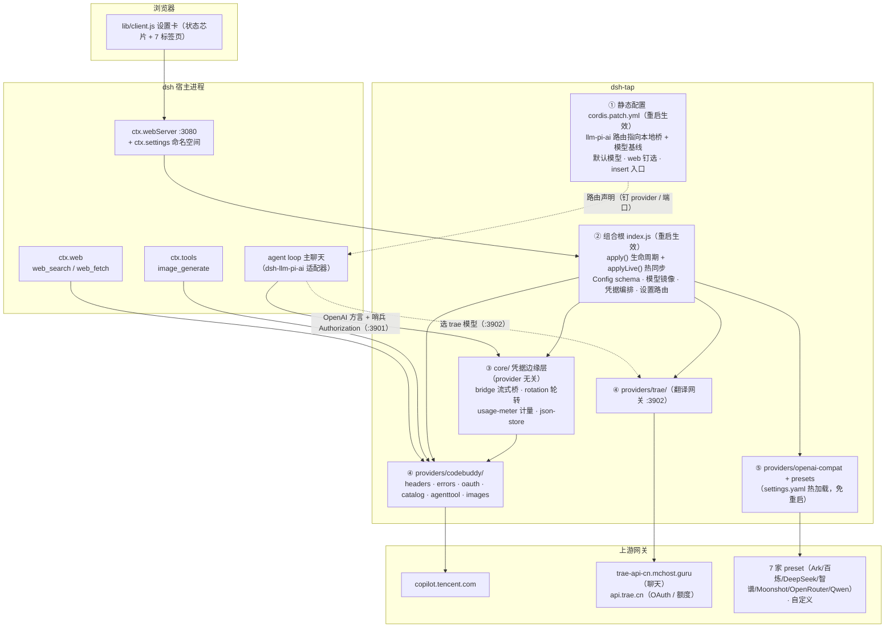
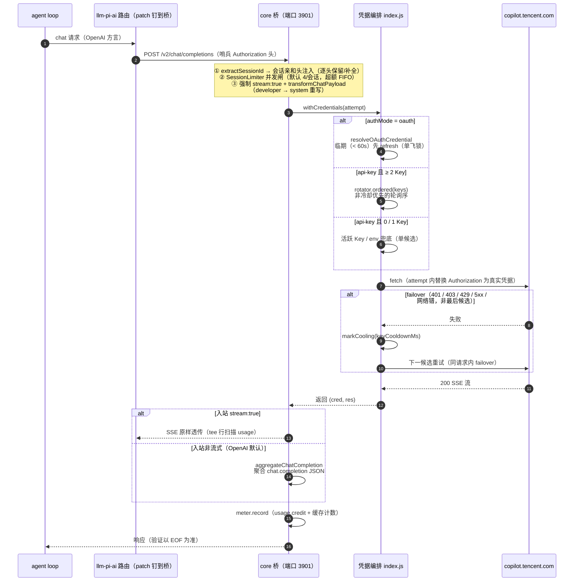
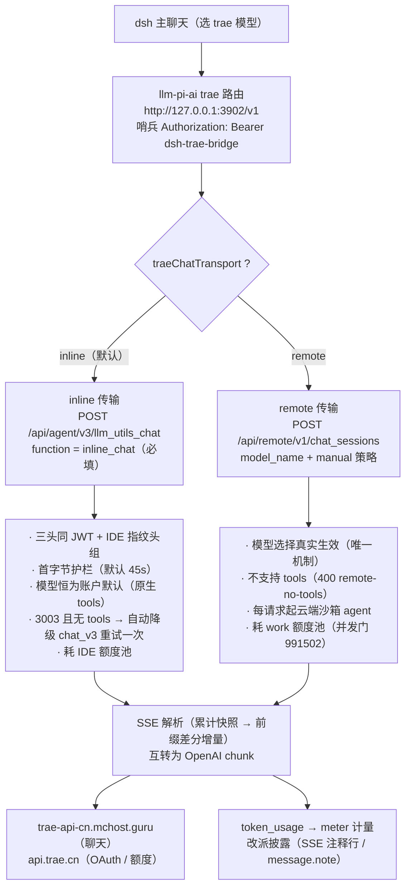
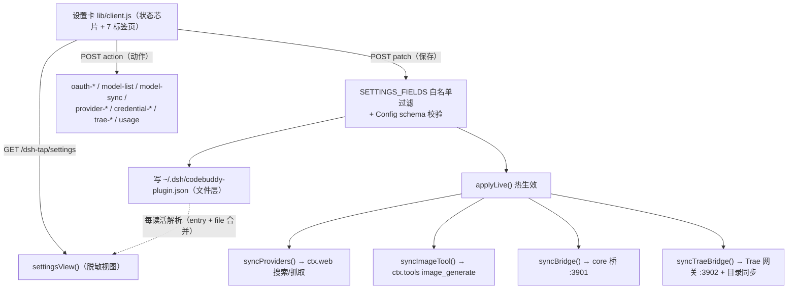

# 01 — 整体架构

> 阅读本页前建议先浏览 [Home.md](Home.md) 的项目定位。

## 分层架构总览

项目按"**改动生效方式**"和"**职责边界**"切层，每层落点单一：

| 层 | 文件 | 职责 | 改动生效方式 |
|----|------|------|--------------|
| 静态配置 | `cordis.patch.yml` | 覆盖 dsh-base 的 `llm-pi-ai`（provider 路由**指向本地桥** + 模型静态基线）、`agent-default-model`（默认模型 deepseek-v3）、`web`（provider 钉选）、`insert` 入口 | 重启 dsh |
| 组合根 | `index.js` | Config/schema、模型管理（patch 解析 + settings.yaml 镜像）、凭据编排（core 轮转 + provider OAuth 分支）、设置路由、apply 生命周期 | 重启 dsh |
| 凭据边缘层 | `core/` | **provider 无关**：json-store（文件层/env 解析）、rotation（KeyRotator 轮询/冷却/failover）、usage-meter（计量存储）、bridge（流式桥：会话归因/并发闸/SSE 聚合/取证；上游特化全走 provider 钩子） | 重启 dsh |
| 上游适配器 | `providers/codebuddy/` | 全部 CodeBuddy 网关事实：headers、错误码表、OAuth 设备流、catalog（/v3/config + 额度方言）、agenttool（search/webfetch）、images（生图） | 重启 dsh |
| 上游适配器（v0.8.x） | `providers/trae/` | 全部 TraeWork CN 事实：自持设备密钥 OAuth、state.vscdb 目录、OpenAI↔Trae 翻译网关 :3902、remote 会话传输、错误信封 | 网关端口/域名/路由块全部热生效（settings.yaml 镜像整块铺/删） |
| 多服务商 | `providers/openai-compat.js` + presets | key 型 OpenAI 兼容上游注册表（共享骨架 + 每上游 preset） | 免重启（settings.yaml 热加载） |
| 浏览器半 | `lib/client.js` | Settings → 插件配置 的设置卡（状态芯片 + 7 标签页，懒挂载隐藏不卸载） | 刷新页面 |

### 架构总览图

### 为什么 core/ 与 providers/ 分开

`core/` 是可复用的"凭据边缘层"，不含任何具体上游名字（静态扫描证伪测试 `scripts/verify-core-generic.mjs` 锁定）。接入第二个 OpenAI 兼容上游时，只需按 `providers/<name>/` 形态另写一个适配器，core/ **零改动**——该测试就是用内联 mock 适配器完整跑通 core 桥/轮转/计量来证明这一点的。

## 主聊天请求路径（最重要的一条链）

dsh 主聊天不直连网关，而是经 patch 把 provider 路由钉到**本地流式桥**，凭据由桥统一收口：

### 哨兵 Authorization 机制（为什么 patch 不写 apiKeyEnv）

pi-ai 在无 `apiKeyEnv` 时本会拒绝发请求，但它只检查"有没有 key **或** Authorization 头"；OpenAI SDK 的 `defaultHeaders` 合并顺序在 `authHeaders` 之后，patch 里的静态哨兵头因此真正上线。桥再逐请求把哨兵替换为真实凭据（OAuth 或活跃 Key）——**文件里没有任何密钥，OAuth 登录即覆盖主聊天路径**。Trae 路由同理（哨兵 `Bearer dsh-trae-bridge`）。

注意：dsh-llm-pi-ai 出站会剥掉与 attribution 冲突的头（静态 User-Agent 到不了网关），`/v2` 端点不校验 UA 所以无感；桥的出站头是**重建**的。

## Trae 通道路径（第二上游）

与 CodeBuddy 同构（OAuth 边缘 + 本地网关 + 目录镜像），差异三点：

1. **凭据只有 OAuth 一支**：自持 ECDSA P-256 设备密钥（`providers/trae/oauth.js`），refresh 的 DeviceProof 自签；
2. **网关是协议翻译器不是透传代理**：`providers/trae/gateway.js`（:3902）把 OpenAI Chat Completions 翻译成 Trae 私有协议（`llm_utils_chat` inline 面 / `chat_sessions` remote 面），复用 core 的 `SessionLimiter` 与 usage-meter；
3. **模型可见性 = 路由存在性管理**（0.8.7 / dsh 0.1.1-rc.2 适配，踩坑 #25 终版）：patch **不带** trae 静态基线，镜像独占路由完整定义——启用+已同步铺完整 `providers.trae` 块（displayName/api/baseURL/headers/models，baseURL 跟随 `traeBridgePort`）；禁用/未同步/全禁用**删除整块**（路由消失、选择器隐藏、chokidar 热加载免重启）。旧"空数组遮蔽"策略已失效——llm-pi-ai 现在在 apply 时对空 models 清单直接 throw，连坐整棵 llm-pi-ai 纤维。

## 设置数据流

设置卡不依赖 dsh 官方 settings 服务数据面（历史上两侧实例不通，踩坑 #2；rc.7 起注册命名空间仅作**派发声明**），走自有 HTTP 路由：

OAuth 令牌单独存 `~/.dsh/codebuddy-plugin-auth.json` / `~/.dsh/trae-plugin-auth.json`，**永不回传浏览器**；key 只回脱敏形式（`ck_a…5678`）。

## 模型镜像机制（设置卡 ↔ 选择器）

模型可见性靠写 `~/.dsh/settings.yaml` 的覆盖层实现（chokidar 热加载、免重启）：

- **CodeBuddy**：`llm-pi-ai.providers.codebuddy.models` = `computeEffectiveModels()`。基清单 = 静态 18 个 ∪ 动态目录（`/v3/config` 启动同步），再减 disabled、加 extra、应用 overrides（contextWindow/maxTokens 覆盖）。纯净态（无 disabled/extra/overrides 且无动态目录）时**删除**覆盖层，避免陈旧清单遮蔽 patch 更新。
- **Trae**：**整块铺/删**（路由存在性管理）——启用+已同步铺完整 `providers.trae` 块（剔除 disabled 的模型清单，baseURL 跟随 traeBridgePort）；禁用/未同步/全禁用删整块。patch 不带基线，删块即干净、无回落。
- **多服务商**（G6）：`llm-pi-ai.providers.<id>` 整块由插件写（先本地校验 + 实测 GET /models 才落盘——坏块会令整个用户层连坐，踩坑 #21），key 写 `~/.dsh/.credentials.yaml` 的 `<ID>_API_KEY`（0600）。

## dsh 宿主缝（插件如何挂进 dsh）

| 缝 | 用法 | 备注 |
|----|------|------|
| `insert`（patch） | `- insert: [{id, name}]` 让 loader 执行 `apply()` | 声明 `dsh.bundle` 的包只应用 patch、不加载 JS（踩坑 #1） |
| `ctx.web` | `registerSearchProvider` / `registerFetchProvider` | patch `web` 行钉选 codebuddy，避免多 provider 时 AMBIGUOUS |
| `ctx.tools` | `tools.register(image_generate 工具)` | 经 `ctx.inject(['tools'])` 懒解析；schema 必须是最终 JSON Schema（踩坑 #13） |
| `ctx.webServer` | 自有设置路由 `/dsh-tap/settings` | 同源 POST 校验；GET 只读 |
| `ctx.settings`（rc.7+） | `settings.register('dsh-tap', Config)` | 仅作设置页派发声明（keyed 槽位）；读写仍走自有路由（踩坑 #18） |
| `ctx.llm` | **未用** | 桥是传输层代理，模型清单走 patch |
| `ctx.credentials` | **不能用** | 主聊天走哨兵 + 桥内解析，宿主凭据缝覆盖不了这条路径 |

## 关键设计原则

1. **上游事实全部收敛在 `providers/<upstream>/`**，行为裁判依据 `docs/rules/*.md`（每条规则带探测证据，可复跑脚本）。
2. **实例状态纪律**：core/ 与 providers/ 只导出工厂/类；`index.js` 模块作用域每插件实例创建一次（rotator/meter/dynamicCatalog 等）。测试用 `import('index.js?case=A')` 拿独立实例隔离。
3. **降级不崩溃**：桥/网关 listen 失败、计量写入失败、取证日志失败一律 best-effort 吞掉并留状态字段。
4. **诚实披露**：模型被服务端改派时以 SSE 注释行 / `message.note` / 计量真实模型披露，绝不假装请求模型被服务。
