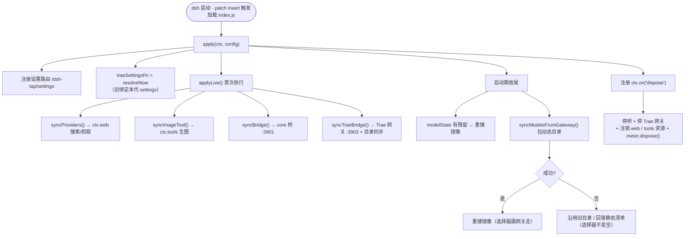
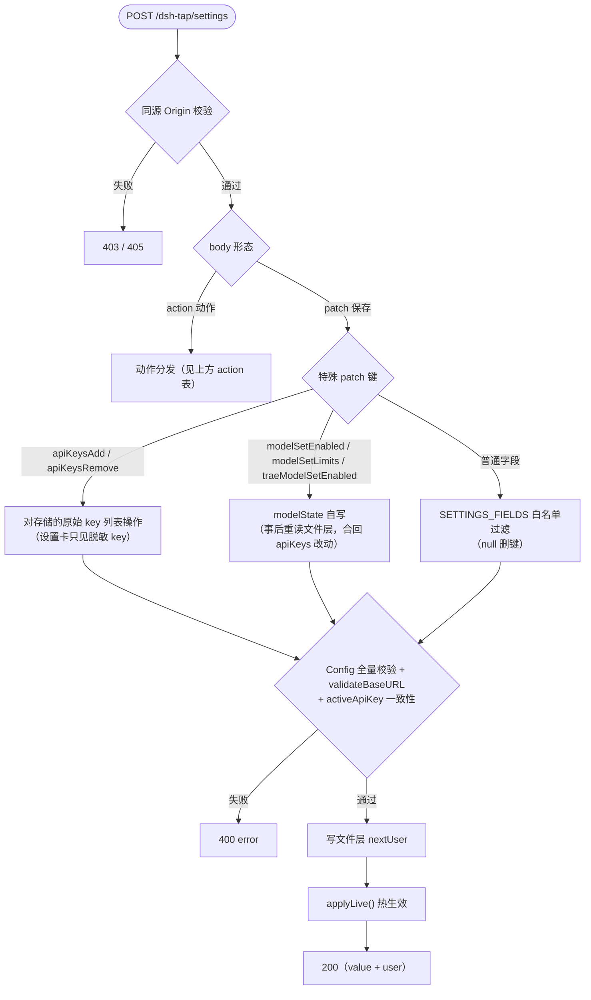

# 02 — 组合根 index.js

> 文件：[index.js](../index.js)（~1380 行，插件入口与导出契约所在）。
> 上游无关的机制在 [03-core-layer.md](03-core-layer.md)；上游事实在 [04](04-provider-codebuddy.md)/[05](05-provider-trae.md)。

## 模块导出契约

| 导出 | 类型 | 说明 |
|------|------|------|
| `name` | `string` | `'dsh-tap'`（dsh 注册名；0.9.0 更名自 `dsh-codebuddy-plugin`，升级需 `dsh plugin rm` 旧包后重新 add） |
| `inject` | `string[]` | `['web']`（webServer/tools/settings 经 `ctx.inject` 懒解析） |
| `Config` | schema | 设置 schema（schemastery），见下表 |
| `SETTINGS_FIELDS` | `array` | 字段元数据（设置卡渲染用；也是 POST 白名单的唯一依据） |
| `makeSearchProvider` | function | 透传自 codebuddy provider（宿主可直接消费） |
| `apply(ctx, config)` | function | dsh 调用的生命周期入口 |

> 仓库瘦身提交已清理历史死导出：`makeFetchProvider` / `makeImageGenTool` / `computeEffectiveModels` / `syncModelsToDshSettings` 及存储路径常量（`SETTINGS_PATH` / `AUTH_PATH` / `TRAE_AUTH_PATH` 等）现为**模块内部符号**，不再导出。

## Config schema（全部字段）

解析规则：`Config({ ...entryConfig, ...readFileLayer() })` —— **文件层 > 组合入口 > schema 默认值**，每次读取活解析。

| 字段 | 类型/默认 | 说明 |
|------|-----------|------|
| `authMode` | `'api-key'` \| `'oauth'`（默认 api-key） | 登录模式 |
| `apiKeyEnv` | string（默认 `CODEBUDDY_API_KEY`，credential-ref） | 单 Key 兜底引用（env > `~/.dsh/.credentials.yaml`） |
| `apiKeys` | `[{name, key}]`（默认 `[]`） | 多 Key 列表（≥2 触发轮询） |
| `activeApiKey` | string（无默认） | 活跃 Key 名（api-key 模式优先于 env 兜底） |
| `searchEnabled` | bool（true） | web_search/web_fetch 后端开关 |
| `baseURL` | string（`https://copilot.tencent.com`） | 网关根地址 |
| `searchMaxResults` | 1–20（5） | 搜索默认条数 |
| `fetchBodyCap` | ≥1000（200000） | 抓取正文上限（字符） |
| `bridgeEnabled` | bool（true） | 流式桥开关（**关掉主聊天断**） |
| `bridgePort` | 1–65535（3901） | 桥端口（须与 patch baseURL 一致） |
| `sessionHeadersEnabled` | bool（true） | 会话归因头注入开关 |
| `sessionHeaderFormat` | `'openai'` \| `'openrouter'` | 会话头格式 |
| `maxConcurrentPerSession` | 1–100（4） | 每会话并发上限（FIFO 排队） |
| `imageGenEnabled` | bool（true） | image_generate 工具开关 |
| `imageGenModel` | string（`hunyuan-image-v3.0-art`） | 生图模型 |
| `keyCooldownMs` | ≥100（60000） | 失败 Key 冷却时长 |
| `quotaTotalManual` | ≥0（0） | api-key 模式手填总额度（估算档；OAuth 用真实 API） |
| `effortByModel` | dict<string,string>（{}） | G8 逐模型思考强度：档位名 → 桥出站注入 `reasoning_effort` 线值（off 线值 null/无表模型/非法档位均不注入；调用方显式携带不覆盖） |
| `traeEnabled` | bool（false） | TraeWork CN 通道总开关 |
| `traeAuthBaseURL` | string（`https://api.trae.cn`） | OAuth 域 |
| `traeChatBaseURL` | string（`https://trae-api-cn.mchost.guru`） | 聊天网关域 |
| `traeLoginHost` | string（`https://www.trae.cn`） | 授权页域 |
| `traeBridgePort` | 1–65535（3902） | 翻译网关端口 |
| `traeChatTransport` | `'inline'` \| `'remote'`（inline） | 聊天传输（remote = 真实模型选择） |
| `upstreamFirstByteTimeoutMs` | 1000–300000（45000） | inline 上游首字节护栏 |

## apply(ctx, config) 生命周期

```js
export function apply(ctx, config = {}) {
  const resolveNow = () => Config({ ...config, ...readFileLayer() })
  // ... 注册四类资源 + 设置路由 + 启动同步 ...
  ctx.on('dispose', () => { /* 停桥/网关、注销工具与 provider、meter.dispose() */ })
}
```

apply 内创建**本代**资源（每 apply 一次新实例，捕获本代 `resolveNow`）：

1. **搜索/抓取后端** `syncProviders()`——`searchEnabled` 开启时注册 `ctx.web` 的两个 provider，禁用即注销。patch 在 `web` 行钉选 codebuddy；禁用期间该缝报 CONFIGURED_MISSING（语义即"功能关闭"）。
2. **生图工具** `syncImageTool()`——`ctx.inject(['tools'])` 懒解析后注册 `image_generate`；注册失败降级 stderr 日志不崩。
3. **settings 命名空间声明**（rc.7+）——`ctx.inject(['settings'])` 内 `sctx.settings.register('dsh-tap', Config)`，仅为设置页派发卡片的声明；数据面仍走自有路由。
4. **core 桥** `createBridge({ settings: resolveNow, provider, withCredentials, meter, forensics, runtime: bridgeRuntime })`——`syncBridge()` 按开关/端口起停。`bridgeRuntime` 是模块级共享（生产单实例 last-apply-wins 正确；verify-bridge §10 钉语义）。
5. **Trae 通道**——`traeSettingsFn = resolveNow`（迟绑定，网关每次读"本代" settings）；`syncTraeBridge()` 起停 :3902 网关 + 尝试目录同步（静默失败）。
6. **设置路由** `registerSettingsRoute(ctx, config, resolveNow, applyLive)`。
7. **启动同步**——`modelState` 有残留则重铺镜像；`syncModelsFromGateway()` 从 `/v3/config` 拉动态目录（失败无感回落静态清单）。

`applyLive()` = `syncProviders() + syncImageTool() + syncBridge() + syncTraeBridge()`，设置卡每次保存成功后调用——**这就是设置免重启生效的机制**。

### apply 生命周期图



## 模型管理（CodeBuddy 侧）

| 函数 | 职责 |
|------|------|
| `readStaticModels()` | 解析 `cordis.patch.yml` 的 `llm-pi-ai.providers.codebuddy.models`（单一事实源；解析失败返回 `[]`） |
| `catalogToProfile(m)` | 目录条目 → profile（尺寸/图像能力；目录不给档位清单） |
| `computeBaseModels()` | 基清单 = 动态目录 ∪ 静态：目录刷新同名静态条目的名称/尺寸，静态的 `reasoningEfforts` 档位表保留；纯静态 id 保留（deepseek-v3 不在目录但可用且是默认模型） |
| `computeEffectiveModels()` | 基清单 − disabled + extra，再应用 `overrides`（contextWindow/maxTokens 逐模型覆盖） |
| `syncModelsToDshSettings()` | 镜像到 `~/.dsh/settings.yaml` 的 `llm-pi-ai.providers.codebuddy.models`（注释保留的 YAML 文档编辑）；**纯净态删路径**，否则恒铺有效清单 |
| `setModelEnabled({id, enabled, profile})` | 启停一个模型：基清单模型只动 `disabled` 标记；目录新增模型启用写 `extra`、禁用只删 extra（不写 disabled，保持可回归纯净态） |
| `setModelLimits({id, contextWindow, maxTokens})` | G5 覆盖值：必须正整数且不得超过基清单实际上限；`null` 清除该字段 |
| `syncModelsFromGateway(resolveNow)` | G4 动态目录同步（单飞锁）：成功换新 `dynamicCatalog` 并重铺；失败时已有旧目录则沿用重铺，否则回落静态 + 纯净态纪律——**选择器绝不变空** |

实例状态：`dynamicCatalog`（`null` = 未同步）、`modelSyncInFlight`（单飞）。

## 凭据编排（CodeBuddy 侧）

| 函数 | 职责 |
|------|------|
| `envKey(envName)` | 单 Key 兜底：`process.env` > `~/.dsh/.credentials.yaml`（`resolveEnvKey`） |
| `resolveCredential(settings)` | **不轮询**的单凭据解析（catalog/额度端点用）：oauth 分支 → `provider.oauth.resolveOAuthCredential`；api-key 分支 → 活跃列表项 ?? env 兜底 |
| `resolveCredentialCandidates(settings)` | 一次出站的候选序：oauth → 0/1 个；api-key → 0 key 走 env 兜底、1 key 直用、≥2 key 走 `rotator.ordered()`（非冷却优先轮询序） |
| `withKeyRotation(settings, attempt)` | `rotator.run(candidates, attempt, {cooldownMs, emptyError})`；空候选错误带 `credentialUnavailable` 标记（桥凭标记判 503，不匹配文案） |

依赖注入形态：`createCodeBuddyProvider({ meter, readAuth, writeAuth, envKey, withKeyRotation, resolveCredential, dshHome })` —— `withKeyRotation`/`resolveCredential` 是**迟绑定箭头**（hoisted 函数声明），解开"provider 需要 rotation、rotation 需要 provider 的 OAuth 分支"的循环引用。

## 多服务商注册表（G6/G7）

| 函数 | 职责 |
|------|------|
| `readManagedProviders()` / `writeManagedProviders(list)` | 登记册 = 文件层 `managedProviders`（无 secret；空表时删键保持纯净） |
| `writeCredential(ref, value)` / `deleteCredential(ref)` | 写/删 `~/.dsh/.credentials.yaml`（**写后 chmod 0600**——dsh 凭据缝要求） |
| `writeProviderBlock(id, block)` | 写/删（`null`）`llm-pi-ai.providers.<id>` 块（注释保留编辑） |
| `addExtraProvider({preset, id, baseURL, displayName, apiKey})` | 添加上游五步：preset/自定义校验 → 保留路由检查（`codebuddy` 禁用）→ **实测 GET /models 验 key**（失败不落盘）→ 写凭据 → 写块 → 登记册 |
| `removeExtraProvider(id)` | 删块 + 删凭据 + 出登记册（外部已删块也照常清理） |
| `refreshExtraProviderModels(id)` | 重拉模型清单（key 从 credentials.yaml 活解析；preset 条目的 fallbackModels/staticCatalog 一并透传） |
| `extraProvidersView()` | 设置卡视图：登记册 × settings.yaml 实况对账，块被外部删除的条目自动出册；key 只回脱敏 |

presets 常量：`PROVIDER_PRESETS = [arkProvider, bailianProvider, deepseekProvider, bigmodelProvider, moonshotProvider, openrouterProvider, qwenProvider]`（0.9.5 起 8 家，0.9.6 移除停服的 iFlow 后 7 家）。

## Trae 通道接线

| 函数/变量 | 职责 |
|------|------|
| `withTraeCredentials(settingsFn, attempt)` | Trae 凭据候选（OAuth 单候选无轮换）：`{cred, res, err}` 三态返回；空候选错误带 `credentialUnavailable` |
| `traeSettingsFn` | 迟绑定模块变量——apply 每代重设为 `resolveNow`；`createTraeProvider({ settings: () => traeSettingsFn(), ... })` |
| `syncTraeModelsToDshSettings()` | **整块铺/删** `llm-pi-ai.providers.trae`（路由存在性管理，0.8.7 起）：启用+已同步 → 铺完整块（displayName/api/baseURL/headers/models，baseURL 跟随 traeBridgePort）；禁用/未同步/全禁用 → 删整块。patch 无 trae 基线，删块即无回落。升级注意：≤0.8.5 写的旧 trae 块只带 models 路径，重启前须先清掉 |
| `setTraeModelEnabled({id, enabled})` | Trae 模型启停（要求先同步目录） |
| `readTraeModelState()` | 文件层 `traeModelState.disabled` |

`traeProvider = createTraeProvider({ readAuth, writeAuth, settings, withCredentials, meter, runtime: traeRuntime, forensics: { logPath: () => process.env.TRAE_BRIDGE_LOG } })`。

## 设置路由契约

路由：`/dsh-tap/settings`（经 `ctx.inject(['webServer'])` 注册）。

- **GET** → `settingsView(resolveNow)`：`{ value（脱敏）, user（文件层原文，不含 secret 字段之外的内容）, fields, oauth, bridge, trae, models }`
- **POST**（同源校验 `sameOrigin`，否则 403/405）：
  - `{patch: {...}}` —— merge & apply。特殊 patch 键：`apiKeysAdd`/`apiKeysRemove`（卡只见脱敏 key，增删必须在此对原始列表操作）、`modelSetEnabled`/`modelSetLimits`/`traeModelSetEnabled`（内部自写 modelState，事后重读文件层合回本请求的 apiKeys 改动——层叠纪律）。其余键走 `SETTINGS_FIELDS` 白名单（**不是** `Config({})` 的键集——无默认值字段如 `activeApiKey` 不会出现在解析产物里，踩坑 #12），`null` 删键。落盘前过 `Config` 全量校验 + `validateBaseURL`（主/trae 各 baseURL）+ `activeApiKey` 一致性。
  - `{action: ...}` —— 动作表：

| action | 行为 |
|--------|------|
| `oauth-start` / `oauth-status` / `oauth-logout` | CodeBuddy OAuth 三件套 |
| `model-list` | 拉网关目录 + ceilings/profiles（G5 覆盖值）/staticEfforts/state |
| `model-sync` | 重新同步 `/v3/config` 并重铺镜像 |
| `provider-list` / `provider-add` / `provider-remove` / `provider-refresh` | 多服务商注册表 CRUD |
| `credential-scan` / `credential-import` | G7 本机登录态扫描 / 确认后导入（命中同名 preset 走 preset 通道拿 fallbackModels） |
| `trae-oauth-start` / `trae-oauth-status` / `trae-oauth-logout` | Trae OAuth 三件套 |
| `trae-model-sync` / `trae-model-list` | Trae 目录同步（可带 dbPath）/ 列表 |
| `usage` | `meter.view()` + 桥状态 + `quotaSnapshot`（60s 缓存） |

### POST 处理决策图



辅助函数：`sendJSON`、`sameOrigin`、`maskKey`（首 4 + 尾 4）、`settingsView`、`validateBaseURL`（绝对 http(s)）。

## 已验证的网关事实速查（改上游行为前先读 docs/rules/）

- `/v2/chat/completions` **仅流式**（非流式 11101）；`reasoning_effort` 接受 off/low/medium/high/max。
- `/agenttool/v1/search`、`/agenttool/v1/webfetch`：`ck_` Key 直调可用；UA 历史上被 12403 拒过，2026-08-19 复测已无 UA 门。
- `/v3/config`：网关自有目录，UA 门只做子串匹配 `CodeBuddy/x.y`；API key 另带 `x-api-key`，OAuth 走 Authorization。
- `/v2/images/generations`：生图可用（~22s/张）；video/3D 路由存在但一律 14407，不接入。
- OAuth 设备流：`/v2/plugin/auth/state?platform=CLI` → 浏览器授权 → 轮询 token（11217=未完成三态同码）→ account；刷新 `/v2/plugin/auth/token/refresh`。
- 额度：`GET /v2/accounts`（账户元数据）、`POST /v2/billing/meter/get-dosage-notify`（低额告警）、`POST /billing/meter/get-user-resource`（**数值剩余额度，OAuth 专属**）；chat 响应头无 quota 字段，计费靠每请求 `usage.credit` 自报。
- **content_filter 事件（0.7.4 已解）**：网关审核对含 `role:"developer"` 的 payload 拒绝；根因是 pi-ai 把推理模型 system prompt 序列化为 developer——桥出站重写 developer→system（verify-bridge §9 锁回归）。
- 提示缓存按内容寻址自动生效、与头无关；**按模型分策略**（v4-pro 有缓存、v3 恒 0；glm-5.1/5.2 条目秒-分钟级失效非单调）。详见 `docs/diagnosis-cache-quota.md`。

完整事实清单见 `docs/rules/gateway-facts.md`（摘要总表），逐字段裁判细节与证据路径见 `docs/rules/` 专题文件。
