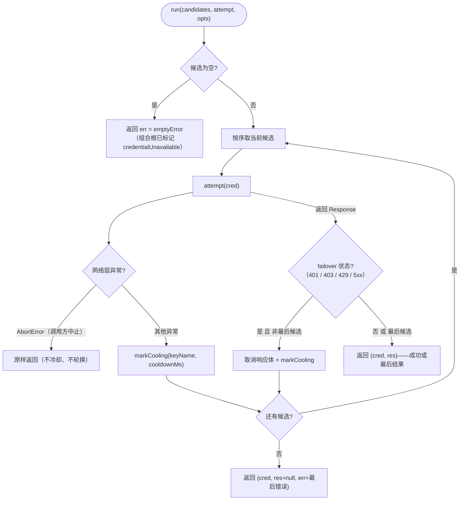
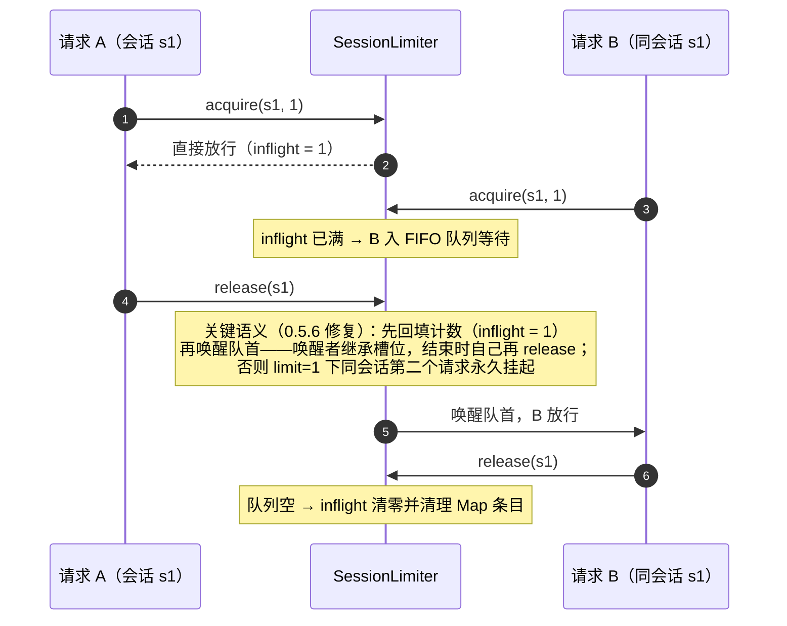
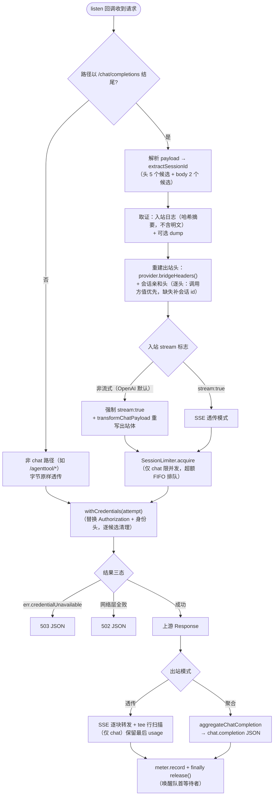

# 03 — core/ 凭据边缘层

> 目录：[core/](../core)。**Provider 无关层**——四份文件不得出现任何具体上游名字（CodeBuddy/Trae/Ark…）、网关错误码或厂商头名，`scripts/verify-core-generic.mjs` 的静态扫描锁定该契约。上游特化全部经 provider 钩子注入（见 [bridge](#corebridgejs) 一节）。

## core/json-store.js — 文件持久化与凭据解析

| 导出 | 签名 | 说明 |
|------|------|------|
| `readJson` | `(path) => object` | 读 JSON 对象文件；缺失/损坏/非对象一律返回 `{}`（不抛） |
| `writeJson` | `(path, value) => void` | 写 JSON（pretty + 换行），递归建父目录 |
| `resolveEnvKey` | `(envName, credFilePath) => string\|null` | 命名凭据解析：`process.env[envName]` 优先，其次在扁平 YAML 凭据文件里按行正则匹配 `NAME: value`（`~/.dsh/.credentials.yaml` 形态）；两处都无 → `null` |

## core/rotation.js — 多凭据轮转引擎

```js
export class KeyRotator {
  constructor()
  markCooling(name, cooldownMs)        // keyName → 冷却截止 epoch ms
  ordered(keys)                        // 一次出站的候选序
  async run(candidates, attempt, { cooldownMs, emptyError })  // failover 执行器
}
```

- **`ordered(keys)`**：每个 key 恰出现一次；轮询游标 `this.cursor` 每次调用前进 1；非冷却 key 按轮询序在前，冷却中的追加为兜底。返回候选对象 `{authorization: 'Bearer <key>', headers: {}, keyName}`。0/1 key 的场景由调用方处理（**不碰游标**）。
- **`run(candidates, attempt, opts)`**：逐候选执行 `attempt(cred)`：
  - 网络层抛错 → 该 key 冷却并 failover（`AbortError` 例外：调用方主动中止，不冷却不轮换，原样返回）；
  - HTTP 状态命中 failover 状态（401/403/429/5xx，内置固定策略；非最后一个候选）→ 取消响应体、冷却、下一个；
  - **最后一个候选的响应/错误原样返回**（不再重试）。
  - 候选为空 → 直接返回 `{cred: null, res: null, err: emptyError}`（空候选错误由组合根注入，带 `credentialUnavailable` 标记）。
  - 返回形态恒为 `{ cred, res, err }`，`res`/`err` 恰一非空。

**实例状态纪律**：冷却表与游标在 KeyRotator 实例上（非模块全局）——组合根每插件模块实例创建一个 `new KeyRotator()`；verify-rotation 用 `?case=` 双实例保持隔离。

### run() failover 流程图



## core/usage-meter.js — 用量计量存储

```js
export function createUsageMeter({ path }) // => { record, view, dispose }
```

- **`record({ ts, kind, model, usage })`**：记录一次计费请求。usage 契约 = OpenAI SSE usage 对象 + 可选 `credit` 字段：`{ prompt_tokens, prompt_cache_hit_tokens, prompt_cache_miss_tokens, completion_tokens, credit }`（缺失字段记 0；无 usage 的请求不记录）。kind ∈ `chat | title | compaction | image | search | fetch`。写失败吞掉（计量绝不破坏数据路径）。
- **`view()`**：设置卡载荷——`since / totalCredit / totalRequests / today{day,credit,requests} / recent（最近 20 条倒序）/ turns（最近 10 轮倒序）/ turnGapMs`。
- **`dispose()`**：清定时器 + 最终 flush。
- 常量：`USAGE_RECENT_CAP = 100`、`USAGE_DAYS_CAP = 31`、`USAGE_FLUSH_MS = 5000`（**去抖写盘**——工具循环连发只落一次盘）、`TURN_GAP_MS = 45_000`（近似轮次判定：间隔 ≤45s 的请求并为一个 turn；桥看不到宿主轮次边界，属披露过的近似）。
- 持久化目标：`~/.dsh/codebuddy-plugin-usage.json`。

## core/bridge.js — 流式桥（智能代理 + 唯一凭据入口）

### SessionLimiter（导出类）

```js
export class SessionLimiter {
  acquire(id, limit) // Promise<release>；id 为 null 不限流
  release(id)         // 释放一个槽位并唤醒队首等待者
}
```

每会话并发闸：`inflight` 计数表 + `queues` FIFO 等待队列。关键正确性（0.5.6 修复，verify-bridge §4 锁）：`release()` 归还的槽位**先回填 in-flight 计数再唤醒队首**（唤醒者继承槽位，结束时自己再 release）——否则 limit=1 下同会话第二个请求永久挂起。

#### 并发闸时序（limit = 1 示例）



### createBridge({ settings, provider, withCredentials, meter, forensics, runtime })

| 参数 | 类型 | 说明 |
|------|------|------|
| `settings` | `() => object` | 活解析 settings（读 baseURL / sessionHeadersEnabled / sessionHeaderFormat / maxConcurrentPerSession） |
| `provider` | object | 上游适配器钩子（见下表） |
| `withCredentials` | `(attempt) => Promise<{cred,res,err}>` | 凭据执行器（组合根的轮转/OAuth 编排）；调用方 Authorization **永不转发** |
| `meter` | `{ record }` | usage-meter 实例 |
| `forensics` | `{ logPath(), dumpDir() }` | 取证落点（env 名由组合根持有，core 只收路径 getter） |
| `runtime` | `{ running, port, lastError }` | 共享运行态对象（组合根持有，数代 apply 报告同一现实） |

返回 `{ listen }`（`proxyUpstream` 为主流程内部函数，不导出）。

**provider 钩子契约**（全部上游特化经此注入）：

| 钩子 | 说明 |
|------|------|
| `bridgeHeaders()` | 透传调用的静态出站头组 |
| `transformChatPayload(payload)` | chat 出站前的原地重写（codebuddy 用它做 developer→system） |
| `extractUsage(chunk)` | SSE chunk → usage 对象（或 null） |
| `extractStreamError(chunk)` | chunk 是否为错误（truthy 返回 chunk 本身） |
| `bridgeResponseId` | 聚合 chat.completion 的 `id` 字段值 |
| `logHeaderNames` | 取证日志允许记录的头名白名单 |
| `sentinelAuth` | 哨兵 Authorization 值（日志中分类为 `sentinel`，不逐字落盘） |
| `texts.credentialUnavailable` | 无凭据响应的错误文案 |
| `logPrefix` | stderr 生命周期告警前缀 |

### proxyUpstream(req, res, rawBody) — 主流程

1. **会话归因**：`extractSessionId`（头 `x-conversation-id`/`x-session-id`/`session_id`/`x-client-request-id`/`x-session-affinity`，或 body `conversation_id`/`session_id`，按优先级取第一个非空）。开启 `sessionHeadersEnabled` 且有会话 id 时按格式注入出站头（openai 三头 / openrouter 单头）；**逐头处理**——调用方已设置的头保留原值，缺失的补全（桥的头组是重建的，整体"保留"会静默丢弃调用方头——0.5.6 教训）。
2. **并发闸**：仅 chat 请求过 `SessionLimiter.acquire`；记录 `waitMs`。
3. **流式强制**：入站 `stream !== true` 的 chat 走**聚合**路径（出站仍强制 `stream:true`，因为网关 stream-only）；入站 `stream:true` 则 SSE 原样透传。出站前 `transformChatPayload` 重写 payload。
4. **凭据执行**：`withCredentials((cred) => fetch(...))`——每次尝试替换 `outHeaders.Authorization` 并合入 `cred.headers`；**先清除上一个候选贡献的头**（身份头不跨 failover 泄漏）。无凭据（err.credentialUnavailable）→ 503；全候选网络失败 → 502；均为经典 JSON 错误体。
5. **SSE 扫描**：chat 响应字节经行扫描器 tee 一份——`data:` 行含 `"usage"` 时解析并保留最后一份 usage（上游每 chunk 重复携带），结束后 `meter.record`。计量 kind 由 `chatUsageKind` 判定：宿主辅助调用（会话标题/压缩）按 prompt 特征识别，分别记 `title`/`compaction`。
6. **取证**：`CODEBUDDY_BRIDGE_LOG` 开启时每个请求写 in/out 两条 JSONL（in 含 `summarizeChatPayload` 哈希形状摘要——消息文本不落盘，仅 bodySha/msgsSha/预览 60 字符 + marker + 参数统计；authorization 分类为 sentinel/caller-set）。`CODEBUDDY_BRIDGE_DUMP` 开启时**明文**落盘入站 chat body（仅本地诊断用）。两者均 best-effort。

### proxyUpstream 流程图



### listen(port) — 生命周期

- 只绑 `127.0.0.1`；请求体上限 32MB（超限 destroy）。
- **listen 失败绝不崩宿主**（0.7.2 修复，verify-bridge §10 锁）：`server.on('error')` 把 `EADDRINUSE` 等降级为 `runtime.lastError` + stderr 告警——占用者通常是另一个 dsh 实例，其桥仍会代管流量（路由指向端口而非进程）。
- 返回 stop 函数（`server.close` + `closeAllConnections`）。

### 内部辅助函数一览

| 函数 | 说明 |
|------|------|
| `extractSessionId(headers, payload)` | 会话 id 候选序提取 |
| `pickLogHeaders(headers, logHeaderNames, sentinelAuth)` | 取证头白名单 + authorization 分类 |
| `messageText(message)` | 消息文本（string 或分段数组） |
| `detectPayloadMarker(messages)` | 宿主辅助调用识别（`session-title` / `compaction`） |
| `chatUsageKind(payload)` | 计量 kind 判定 |
| `summarizeChatPayload(rawBody, payload)` | 哈希形状摘要（取证日志用） |
| `aggregateChatCompletion(upstream, res, model, tap)` | SSE → chat.completion JSON 聚合（含流内错误透传 502） |

### 关键语义：响应完成

断言"响应完成"而不是首字节——首字节/时间戳看似正确但连接永不收尾的挂死，只有等 EOF 才暴露（verify-bridge 全部断言等连接结束，踩坑 #10）。
