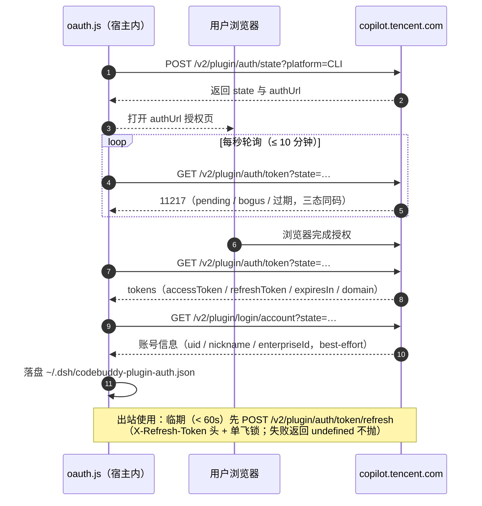

# 04 — providers/codebuddy/（CodeBuddy 上游适配器）

> 目录：[providers/codebuddy](../providers/codebuddy)。本目录收敛**全部** CodeBuddy 网关事实；core/ 只依赖 `index.js` 暴露的结构钩子。行为裁判依据 `docs/rules/`（每条规则带探测证据）。

## index.js — createCodeBuddyProvider(deps)

```js
const provider = createCodeBuddyProvider({
  meter, readAuth, writeAuth, envKey,
  withKeyRotation,   // 迟绑定箭头（组合根 hoisted 函数）
  resolveCredential, // 同上——解开 provider ↔ rotation 的循环引用
  dshHome,
})
```

返回的 provider 对象 = **桥钩子** + **特化能力**两部分：

| 成员 | 说明 |
|------|------|
| `bridgeHeaders()` | 出站静态头组（`{...CLIENT_HEADERS}`，见 headers.js） |
| `transformChatPayload(payload)` | **developer → system 重写**（0.7.4 content_filter 修复）：网关入口校验层对含字面量 `role:"developer"` 的 payload 单列拒绝（500/11128 unapproved channel）；触发源是 pi-ai 把推理模型 system prompt 序列化为 developer。网关对 developer/system 指令语义等价，直接重写。回归锁 verify-bridge §9 |
| `extractUsage(chunk)` | `chunk.usage ?? null`（网关每 chunk 重复携带，含 credit 与缓存计数） |
| `extractStreamError(chunk)` | `chunk.error` 或信封 `code !== 0` |
| `bridgeResponseId` | `'codebuddy-stream-bridge'`（聚合响应 id，保持线上值不变） |
| `logHeaderNames` | 取证头白名单（UA/会话头/IDE 头等 13 项） |
| `sentinelAuth` | `'Bearer dsh-codebuddy-bridge'`（patch 哨兵；日志分类不逐字落盘） |
| `texts.credentialUnavailable` | 无凭据错误文案 |
| `oauth` / `catalog` / `agenttool` / `images` | 四个特化件（下文） |
| `makeSearchProvider` / `makeFetchProvider` / `makeImageGenTool` | 组合根直接消费的工厂透传 |

## headers.js — 客户端头组

```js
export const USER_AGENT = 'CLI/unknown CodeBuddy/2.136.0'
export const CLIENT_HEADERS = { 'User-Agent': USER_AGENT, 'X-IDE-Type': 'CLI', ... }
```

字段判定表（证据 `docs/probes/ua-2026-08-19.jsonl`，74 条，复跑 `scripts/probe-ua.mjs`）：

| 字段 | 判定 |
|------|------|
| UA 中的 `CodeBuddy/2.136.0` 段 | **部分是规则**：`/v3/config` 的 UA 门只做子串匹配 `/codebuddy\/[^a-z\s]*\./i`；`CLI/unknown` 前缀与具体版本号是迷信 |
| X-IDE-* 四头 / X-Requested-With / X-Private-Data / X-Product: SaaS | **迷信**（缺失不影响任何端点 200），零行为变更保留，不作为能力依赖也不贸然下线 |

历史注："/agenttool UA 必须 CLI 形态（12403）"已过时——2026-08-19 复测 /agenttool 无 UA 门。

## errors.js — 错误码表

`ERROR_CODES`（语义参照表，不是触发逻辑；代码路径按位置内联引用，禁止当咒语用）：

| 码 | 语义 |
|----|------|
| 11101 | chat requires stream:true |
| 12403 | user-agent gate（/v3/config） |
| 14401 / 14407 | 路由注册层/配置缺失（image、video/3d 家族） |
| 11102 / 11103 | chat 家族路由未注册 / 后端派发失败 |
| 11128 | unapproved channel（developer 角色的当前拒绝面） |
| 10001 / 11217 / 12153 | OAuth：缺参 / state 未完成（三态同码）/ refresh 无效 |

`CREDENTIAL_UNAVAILABLE_MESSAGE`：空候选错误文案（调用方按此串识别并原样透传，保持 0.7.4 线上一致）。

## oauth.js — 浏览器 OAuth 设备流

```js
export function createOAuth({ readAuth, writeAuth })
// => { resolveOAuthCredential, startOAuth, oauthStatus, logout }
```

流程（对齐官方 CLI，证据 `docs/probes/oauth-2026-08-19.jsonl`）：

1. `POST /v2/plugin/auth/state?platform=CLI` → `{state, authUrl}`（创建无认证；X-No-* 三头实测迷信，保留；platform 必填但任意值皆可）
2. 浏览器打开 authUrl；插件每秒轮询 `GET /v2/plugin/auth/token?state=`（**11217 = pending/bogus/过期三态同码**，10 分钟超时）
3. 成功 → `GET /v2/plugin/login/account?state=` 拉账号（best-effort）→ 落盘 `{auth: {accessToken, expiresAt, refreshToken, ...}, account}`
4. `refreshOAuth(baseURL, auth)`：`POST /v2/plugin/auth/token/refresh`（Bearer 旧 access + `X-Refresh-Token` + 身份头）；**单飞锁** `refreshInFlight`；失败返回 undefined 不抛
5. `resolveOAuthCredential(s)`：每次出站的凭据分支——临期（<60s）自动 refresh；返回 `{authorization: 'Bearer <token>', headers: {X-Domain, X-User-Id, X-Enterprise-Id}}`
6. `oauthStatus()` / `logout()`：视图（令牌永不出宿主）/ 清空存储

### OAuth 设备流时序



## catalog.js — 目录与额度方言

```js
export function createCatalog({ resolveCredential, envKey })
// => { fetchModelCatalog, quotaSnapshot }
```

- **`fetchModelCatalog(settingsFn)`**：`GET /v3/config`。认证方言：`Authorization` + api-key 模式另带 `x-api-key`（OAuth 不带）；UA 过 12403 门。解析 `{code, data:{models, agents}}` → `{models: [{id, name, maxInputTokens, maxOutputTokens, images, cli, reasoning, reasoningEffort}], fetchedAt}`。`agents` 里 name=cli 的条目标记哪些模型对 CLI 可用。
- **`fetchQuotaSnapshot(settingsFn)`**：三路并发——`GET /v2/accounts`（当前账户 = `lastLogin:true` 条目）、`POST /v2/billing/meter/get-dosage-notify`（低额告警文案）、OAuth 模式追加 `POST /billing/meter/get-user-resource`（**数值剩余额度**，OAuth Bearer 专属——`ck_` key 401 不进；api-key 模式直接跳过，卡片回落手填估算档）。资源包解析 `CapacityRemain(Precise)`/`CycleCapacity*`/`TotalDosage`。
- **`quotaSnapshot(settingsFn)`**：60 秒缓存的对外包装，永不抛错。

## agenttool.js — web_search / web_fetch 后端

```js
export function createAgentTool({ withKeyRotation })
// => { makeSearchProvider, makeFetchProvider }
```

- **`callAgentTool(settings, path, payload, signal)`**：`/agenttool/*` 出站统一路径（经 `withKeyRotation`）。错误硬化：网络错沿 `err.cause` 链拼接原因（裸 `fetch failed` 不可调试）；HTTP 错/信封 code 错均嵌入网关 code/msg。凭据不可用错误原样透传。**注意 settings 是函数**（0.7 修复的签名漂移：曾把对象传给期望函数的调用方，抛 `settings is not a function`）。
- **`makeSearchProvider(settings)`**：`POST /agenttool/v1/search {query, type:'text2text', max_results}` → `{sources: [{url,title?,snippet?}], truncated:false}`（截断由网关侧按 max_results 完成）。
- **`makeFetchProvider(settings)`**：`POST /agenttool/v1/webfetch {url}` → `{url, statusCode:200, body:{kind:'text', content.slice(0,fetchBodyCap)}, truncated}`（端点返回解码内容或 JSON 错误，不回目标页 HTTP 状态，故成功恒报 200）。
- 计量说明：search/webfetch 响应体无计量字段（R-Q2 实测），历史 `if (data?.usage)` 是死路径已删。

## images.js — image_generate 生图工具

```js
export function createImageTool({ withKeyRotation, meter, dshHome })
// => { makeImageGenTool }
```

- **工具定义**：`name: 'image_generate'`；`parameters`/`output.schema` 是**手写的最终 JSON Schema**（defineTool 简写转换器在宿主包内插件 import 不到，踩坑 #13）；`output.render` 返回文本块（路径 + 源 URL）；`timeoutMs: 180_000`（实测 ~22s/张留余量）；`isConcurrencySafe: true`。
- **execute**：`POST /v2/images/generations {model: imageGenModel, prompt, size, n:1}`（size 正则校验，默认 1024x1024）；响应 `data.usage` 存在则计量（kind=image）；产出 url 或 b64_json 二选一 → 下载/解码 → 落盘 PNG。落盘目录：会话工作区 `generated-images/`（`exec.agent` 的 workspaceDir/workDir/cwd 逐级探测），无工作区时 `<dshHome>/generated-images`。
- 路由边界：`/v2/videos/generations`、`/v2/3d/generations` 路由存在但当前账号一律 14407，**不接入**（证据 `docs/probes/media-2026-08-17.json`）。
