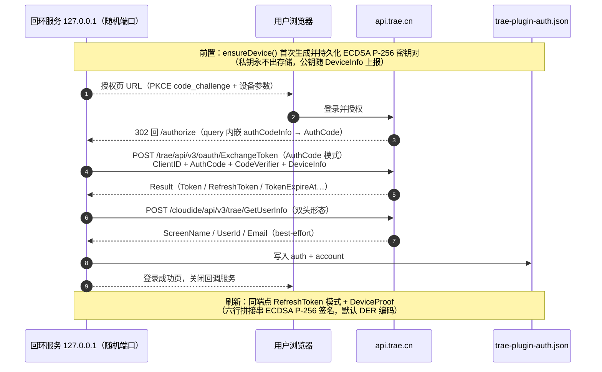
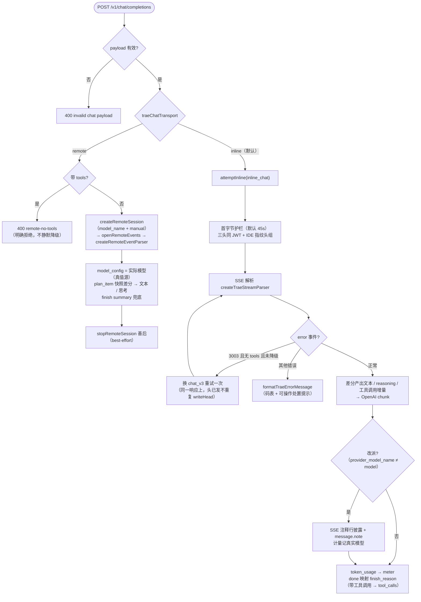

# 05 — providers/trae/（TraeWork CN 订阅额度通道）

> 目录：[providers/trae](../providers/trae)。与 `providers/codebuddy/` 同构：本目录收敛全部 Trae 上游事实，core/ 与组合根经结构钩子消费。证据档案：`docs/reverse/traework-cn.md`、`docs/reverse/trae-cloud-api.md`、`docs/diagnosis-trae-3003.md`。

## 通道总览

| 维度 | 事实 |
|------|------|
| 域名分工 | OAuth/账号面 = `api.trae.cn`；聊天网关 = `trae-api-cn.mchost.guru`（`/api/agent/v3/*`） |
| 凭据 | **只有 OAuth**（订阅额度跟账号走，无多 Key 轮换）；设备密钥**自持**（P-256） |
| 认证头 | 双头 `Authorization: Cloud-IDE-JWT <token>` + `x-cloudide-token`（+ `X-User-Region: CN`） |
| 聊天传输 | `inline`（默认，`llm_utils_chat` + `function:inline_chat`，原生 tools、耗 IDE 池）｜`remote`（`chat_sessions`，**唯一真实模型选择**、无 tools、耗 work 池） |
| inline 面模型 | **恒为账户默认**（model 字段不被路由；非默认模型名 3003）；改派真值源 = SSE `timing_cost.provider_model_name` |
| 模型目录 | 本机 state.vscdb（TRAE SOLO CN 全局状态库）只读提取，24 个 preset 模型 |
| 限流 | 4011 紧（inline 联调间隔 ≥20s）；remote 面无 4011 但有排队与并发门 991502 |
| 额度双池 | `POST api.trae.cn/trae/api/v2/pay/ide_user_ent_usage` 按 `entitlement_base_info.available_endpoint` 分池（0=IDE、1=work） |

## index.js — createTraeProvider(deps)

```js
export const TRAE_PROVIDER_ID = 'trae'

const provider = createTraeProvider({
  readAuth, writeAuth,          // ~/.dsh/trae-plugin-auth.json IO
  settings: () => traeSettingsFn(),   // 迟绑定本代 settings（apply 每代重设）
  withCredentials,              // (attempt) => {cred,res,err}，单候选 OAuth
  meter, runtime, forensics,
})
```

返回 provider：`{ id, oauth, gateway, syncCatalog({dbPath}), catalogView(), catalogIds(), credentialView() }`。

- `syncCatalog`：从本机 state.vscdb 拉一次目录（单飞语义在调用方），成功换新 `catalogState`；
- `catalogView()`：`{ at, count, candidate, profiles } | null`；
- `credentialView()`：OAuth 视图（设置卡）。

## oauth.js — 自持设备密钥的 OAuth 设备流

```js
export function createTraeOAuth({ readAuth, writeAuth })
// => { resolveTraeCredential, startOAuth, oauthStatus, logout, setSignatureFormat }
```

**关键设计**：设备密钥对由**本插件生成并持有**（首次登录时生成 ECDSA P-256 PKCS#8，存 `~/.dsh/trae-plugin-auth.json` 的 `device`），`DeviceInfo.DevicePublicKey` 上报公钥——因此 refresh 的 `DeviceProof` 签名完全自控，不依赖官方 IDE 安全存储（存量 token 在 state.vscdb/凭据管理器里都不存在，已实证排除）。

流程：

1. **登录**（`startOAuth(s)`）：本地回环服务 `127.0.0.1:<随机端口>/authorize` → 授权页 URL 带 **PKCE**（`code_challenge=S256`）→ 浏览器完成登录 302 回调，query 的 `authCodeInfo` JSON 内嵌 AuthCode → `POST <authBase>/trae/api/v3/oauth/ExchangeToken`（**AuthCode 模式**：`{ClientID, AuthCode, CodeVerifier, DeviceInfo, IDEVersion}`）→ `Result.{Token, RefreshToken, TokenExpireAt...}` → best-effort 拉 `GetUserInfo`（昵称字段 = `ScreenName`）→ 落盘 → 关回调服务。10 分钟超时。
2. **刷新**（`refreshOAuth(s, auth)`，单飞）：同端点 **RefreshToken 模式** + `DeviceProof{Signature, Timestamp, Nonce}`。签名串逐行拼接：`"POST\n/trae/api/v3/oauth/ExchangeToken\n<ClientID>\n<RefreshToken>\n<Timestamp>\n<Nonce>"`，ECDSA P-256/SHA-256，默认 DER 编码（`signatureFormat: 'der'`，可切 'raw'——`derToRaw` 做 SEQUENCE→r||s 转换，供联调探测）。
3. **凭据分支**（`resolveTraeCredential(s)`）：临期（<60s）自动刷新；返回 `{authorization: 'Cloud-IDE-JWT <token>', headers: {x-cloudide-token, X-User-Region}}`。
4. **logout**：只清令牌与账号，**设备身份保留**（clientId/密钥对与该账号的设备注册绑定，重登录复用）。

常量：`CLIENT_ID_SOLO_LITE = 'en1oxy7wnw8j9n'`（SOLO Lite 分支）、`CLIENT_ID_TRAE = 'ono9krqynydwx5'`、`PLATFORM_CODE='SOLO_PC'`、`IDE_VERSION='0.1.52'`。

### OAuth 设备流时序（自持设备密钥）



## catalog.js — 本机目录提取

```js
export function catalogToProfiles(catalog)   // 目录 → dsh profiles
export function fetchLocalCatalog({ dbPath }) // { profiles, catalog, fetchedAt, source }
```

- 纯函数复用 `scripts/trae-model-catalog.mjs`（`discoverStateDbs` / `copySqliteForRead` / `readModelListCandidates` / `selectDefaultCandidate` / `normalizeCatalog`——该脚本 CLI 入口带 import.meta 守卫，作为库导入不执行 main）。
- 映射规则：只收 **preset 型**条目（`provider` 为空的；deepseek//… BYOK 条目路由到用户自己的 provider 会失败）；`contextWindow` 取 `contextWindowDefault` 回落 `contextWindowMax`（数组取最大档）；`maxTokens` 取 `maxOutputTokens`；`multimodal → input: [text, image]`。
- 提取过程：发现 state.vscdb → **临时副本**读 SQLite（不碰活库）→ 临时目录用后即删。

## gateway.js — OpenAI↔Trae 翻译网关（:3902）

> 与 core 桥的分工：core 桥是**透传代理**（上游说 OpenAI 方言）；本网关是**协议翻译器**（请求/响应都要改写）。复用 core 原语：`SessionLimiter` 与 usage-meter。

```js
export function createTraeGateway(deps)  // => { listen(port), handleChat(req, res, rawBody) }
```

路由：`POST /v1/chat/completions`（或 `/chat/completions`）→ `handleChat`；`GET /v1/models` → 目录 id 清单；其余 404。listen 失败降级 `runtime.lastError` 不崩（同踩坑 #17 纪律）。

### 出站协议构造（导出的纯函数）

| 函数 | 说明 |
|------|------|
| `TRAE_APP_ID` / `TRAE_IDE_VERSION` / `TRAE_IDE_VERSION_CODE` | 客户端指纹常量（`6eefa01c-…`——**≠ OAuth client_id**；版本码必须数字串，`'0.1.52'` 判 missing） |
| `traeOutboundHeaders(device, uid, requestId)` | IDE 指纹头组：凭证三头由调用处合入；x-device-* 设备指纹与登录上报一致；**不发 x-request-pin**（见 pin 会强制 base64 校验必 400）；UA 置空 |
| `toNativeMessages(messages)` | OpenAI messages → Trae 原生：content **必须块数组** `[{type:'text',text}]`（字符串直发 400/4001）；tool_calls/tool 角色原生透传 |
| `nativeTools(tools)` | 工具定义透传；**`parameters` 必须字符串化**（服务端 Go 结构体该字段是 string 型） |
| `buildChatRequest(payload, sessionId)` | 组装 `{messages, model, function:'inline_chat', request_id, session_id, stream:true, max_tokens?, tools?, tool_choice?}` + 生成参数白名单透传（temperature/top_p/stop/seed/reasoning_effort 等） |
| `cumulativeDelta(previous, current)` | **累计快照 → 增量**的前缀差分（Trae 文本是快照不是 delta；回退公共前缀） |
| `createTraeStreamParser()` | 有状态流解析器：吃 `(eventName, dataObj)`，产 `{text?, reasoning?, toolCall?, usage?, queue?, finish?, error?}`。处理 metadata/timing_cost（`provider_model_name` = 改派真值源）/排队位置去重/token_usage/文本差分/工具调用按 index 累积（`function_call` 键 + arguments 增量片段拼接）/done 映射（done 恒 stop，带工具调用时改写为 `tool_calls`——OpenAI 语义需要） |

### handleChat 主流程

1. **传输选择**：`settings().traeChatTransport === 'remote'` → `handleRemoteChat`；否则 inline。
2. **inline**：`attemptInline(fnValue)`，`for(;;)` 循环内可做 **3003 事故回退**——SSE error 3003 且尚未降级且请求无 tools 时，自动换 `function:'chat_v3'` 重试一次（同一 HTTP 响应上，头已发不重复 writeHead）。
3. **首字节护栏**：`upstreamFirstByteTimeoutMs`（默认 45s）——fetch 在响应头到达即 resolve、随即清定时器；只约束"连上却不出头"的死态（边缘/WAF 拦截或本地代理异常），SSE 长流不受影响。
4. **模型改派披露**：`timing_cost.provider_model_name` ≠ 请求模型时，以 **SSE 注释行**（`: trae-reroute requested=… actual=…`）告知一次（OpenAI 解析器忽略、原始流可见）；非流式响应加 `message.note`；计量记真实模型——绝不假装请求模型被服务。
5. **usage/计量**：`token_usage` 事件（snake/camel 宽容映射）→ `meter.record`；取证日志 `TRAE_BRIDGE_LOG`。

### remote 传输（handleRemoteChat）

- 带 tools 的请求**明确拒绝**（400 `remote-no-tools`，不静默降级——远端 agent 自持工具，dsh 工具环会断）。
- 流程：`createRemoteSession`（chat_sessions 创建，`model_name` + `model_selection_strategy:'manual'`——**唯一真实的模型选择机制**）→ `openRemoteEvents`（SSE 事件流）→ `createRemoteEventParser` 解析 → 结束后 `stopRemoteSession` 善后（best-effort）。
- 事件语义：`model_config.config_name` = 实际路由模型（真值源）；`plan_item`（thought=可见文本、reasoning_content=思考，**按 id 分槽的累计快照差分**）；finish 工具 `params.summary` 为最终答复（兜底补发）；`token_usage`、`done`、`error`；queuing/notification 一次性排队提示。

### handleChat 流程图



### remote.js 导出

| 函数 | 说明 |
|------|------|
| `remoteWebHeaders(token, {stream})` | remote 面 Web 客户端形态头（与 raw IDE 头组完全不同的指纹；Origin solo.trae.cn） |
| `flattenQuery(messages)` | OpenAI messages → query 字符串（角色标记扁平化：`[System]/[Assistant]/[Client Tool Call]/[Client Tool Result]`；remote 每请求新建会话，历史只能文本携带） |
| `buildRemoteCreateBody(model, messages)` | chat_sessions 创建体（9router 变体：content 空数组，query 承载全部；`agent_type:'solo_agent_remote'`） |
| `createRemoteSession(baseURL, token, model, messages, {timeoutMs})` | 创建会话 `{sessionId, messageId}`；**边缘韧性**：裸非 JSON 的 404/403（TLB 节点路由漂移/WAF）做一次短退避重试（创建幂等）；20s 超时快速失败 |
| `openRemoteEvents(baseURL, token, sessionId, messageId)` | 拉事件流（调用方读到 EOF） |
| `stopRemoteSession(...)` | 终止会话（best-effort 绝不抛） |
| `createRemoteEventParser()` | 事件解析器（见上） |

## errors.js — 错误码表与信封规范化

| 码 | 语义 |
|----|------|
| 1001 | 聊天网关统一未认证（mchost /api/agent/v3/*） |
| 3003 | all models failed——2026-08-24 起对**一切** model 名触发（inline 面服务端模型解析故障，docs/diagnosis-trae-3003.md；非凭据/配额问题） |
| 1005 | remote 会话套餐/权益门（message 为空、data.plan 携带所需档位） |
| 991502 | solo agent 并发门（solo_agent_parallel_limit 用满；会话随沙箱 TTL 自灭或 stop 端点善后） |
| 10101 | OAuth ExchangeToken：client/参数无效 |
| 20310 | cloudide 面未登录 |

- `TRAE_ERROR_HINTS` + `formatTraeErrorMessage(code, message)`：已知码追加**可操作处置提示**（如 3003 → 提示切 remote 传输）。
- `normalizeTraeError(status, body)`：两种信封（mchost `{code,message}` 与火山系 `ResponseMetadata.Error`）规范化为 `{status, code, message}`；非 JSON/空体容忍为 unknown；message 为空时按码表回填。
- `TRAE_CREDENTIAL_UNAVAILABLE_MESSAGE`：凭据不可用稳定文案。

## 已知边界（诚实标注）

- inline 传输模型恒为账户默认；需要真实模型选择请切 remote（设置卡"聊天传输"）。
- remote 不支持 dsh tools；带 tools 请求会被明确拒绝。
- raw 面限流 4011 紧；remote 面有排队。
- `reasoning_effort` 方言未对 Trae 网关验证（patch 的 trae 路由不带 compat 声明）。
