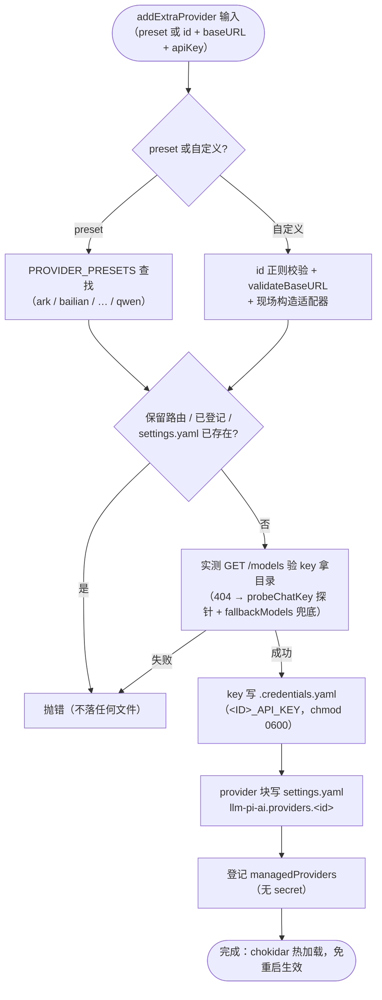

# 06 — 多服务商注册表（openai-compat + presets + local-scan）

> 目标：key 型 OpenAI 兼容上游（火山 Ark / 阿里百炼 / DeepSeek / 智谱 / Moonshot / OpenRouter / Qwen / 自定义）接入 dsh 选择器，**免重启**（settings.yaml chokidar 热加载 + 凭据缝每请求活解析）。机制与 dsh 官方 CustomProviderCard 相同，落点相同、形状相同。裁判文档：`docs/rules/extra-providers.md`。

## providers/openai-compat.js — 共享骨架

本模块与 core/ 一样**不得出现具体上游名**（verify-core-generic 静态扫描覆盖）。

| 导出 | 签名 | 说明 |
|------|------|------|
| `PROVIDER_ID_RE` | `/^[a-z][a-z0-9]*(?:-[a-z0-9]+)*$/` | 路由 id 规则（官方 CustomProviderCard 同款） |
| `keyRefFor(id)` | `(id) => '<ID>_API_KEY'` | 凭据命名惯例：大写、非字母数字折 `_` |
| `fetchOpenAIModels(baseURL, apiKey, {timeoutMs=15000})` | `GET {baseURL}/models`（Bearer key）→ `[{id}]` | 非 2xx 带上游摘要抛错；**HTTP 404 单独标记 `err.code = 'MODELS_ENDPOINT_404'`**（部分上游根本没有 /models 路由）；空清单抛错（key 可能无权限） |
| `providerBlock(preset, models)` | 组装 llm-pi-ai provider 块 | `{displayName, api:'openai-completions', baseURL, apiKeyEnv, models}`——写 settings.yaml 的形状 |
| `probeChatKey(baseURL, apiKey, model, {timeoutMs=20000})` | 最小 chat 探针验 key | `POST /chat/completions`（max_tokens 1）。认证失败的身体特征汇总：标准 401/403 或 `error.code=invalid_api_key` 类，或 HTTP 200 + `{"status":"434"}`（历史 iFlow 方言，同形态通用）；其余一切响应（含模型错误 4xx）视为 key 有效——服务器拒绝的是请求内容不是凭据；网络错误原样抛 |
| `createOpenAICompatProvider(preset)` | 注册表入口 | `{ id, displayName, baseURL, keyRef, fallbackModels, staticCatalog, fetchModels(apiKey), modelBlock(models) }`；`fetchModels`：`staticCatalog` 且带 fallbackModels 时**不调 /models**（公开目录型上游），probeChatKey 验 key + 恒吃内置精选表；否则 /models 404 且 preset 带 fallbackModels 时 → probeChatKey 验 key + 兜底清单 |

## 七个 preset（0.9.5：4 → 8；0.9.6 移除停服的 iFlow）

| preset | id | baseURL | fallbackModels | 备注 |
|--------|-----|---------|------------------|------|
| [ark/index.js](../providers/ark/index.js) | `ark` | `https://ark.cn-beijing.volces.com/api/v3` | — | 火山引擎方舟 |
| [bailian/index.js](../providers/bailian/index.js) | `bailian` | `https://dashscope.aliyuncs.com/compatible-mode/v1` | — | 阿里云百炼兼容模式 |
| [deepseek/index.js](../providers/deepseek/index.js) | `deepseek` | `https://api.deepseek.com/v1` | — | DeepSeek 官方（0.9.5 新增） |
| [bigmodel/index.js](../providers/bigmodel/index.js) | `bigmodel` | `https://open.bigmodel.cn/api/paas/v4` | — | 智谱 BigModel（0.9.5 新增） |
| [moonshot/index.js](../providers/moonshot/index.js) | `moonshot` | `https://api.moonshot.cn/v1` | — | Moonshot AI（0.9.5 新增） |
| [openrouter/index.js](../providers/openrouter/index.js) | `openrouter` | `https://openrouter.ai/api/v1` | 10 个各厂旗舰 | **staticCatalog**：/models 公开（任意 key 200、437 条全量），探针验 key + 内置精选表（0.9.5 新增，E-P7） |
| [qwen/index.js](../providers/qwen/index.js) | `qwen` | `https://portal.qwen.ai/v1` | qwen3-coder-plus/flash | 无 /models；Qwen OAuth 免费额度 2026-04-15 停服，存量 token 大概率被拒（导入探针会如实拒绝） |

preset 即 `createOpenAICompatProvider({id, displayName, baseURL, fallbackModels?, staticCatalog?})` 的调用结果，自定义上游在 `addExtraProvider` 里现场构造同形态适配器。

## 落点与纪律（踩坑 #21）

- **provider 块**写 `~/.dsh/settings.yaml` 的 `llm-pi-ai.providers.<id>`；**key** 写 `~/.dsh/.credentials.yaml` 的 `<ID>_API_KEY`（写后 chmod 0600——非 0600 凭据缝抛错）。
- **写块前必须本地校验 + 实测 GET /models**：settings.yaml 用户层一个坏 provider 块会令**整层连坐**（dsh-settings 解析 catch 后整域冻结），用户手写的其他 provider 全灭。
- 添加顺序（`addExtraProvider`）：校验 → 实测目录（key/URL 错在这步就炸，不落任何文件）→ 写凭据 → 写块 → 登记册。凭据先写是因为可服务性校验不查凭据，块后写保证热加载看到的是完整配置。
- 凭据来源序（dsh 约定）：启动环境快照 > `.credentials.yaml`（chokidar 活层）> .env（冻结）。

### 添加上游流程（addExtraProvider）

## local-scan.js — G7 本机登录态检测

> 红线：扫描**只读**、findings 绝不含 secret 值（只有路径/类型/过期等元数据）；导入是用户确认后的显式动作。

| 导出 | 说明 |
|------|------|
| `scanLocalCredentials()` | 依次跑 `DETECTORS`，返回全部命中 `{source, label, path, kind, importable, reason?, detail?}`；单探测器失败不影响其余 |
| `readImportCredential(findings, source)` | 导入路径专用：按 `finding.detail.import.keyFrom`（文件 + 字段）读凭据真值 → `{id, displayName, baseURL, apiKey}` |

探测器清单：

| source | 路径 | 可导入 | 说明 |
|--------|------|--------|------|
| `qwen` | `~/.qwen/oauth_creds.json` | ✔（access_token 当 Bearer 直用，端点 `https://<resource_url>/v1`） | OAuth；`expiredHint` 只是提示，有效性以导入探针实测为准 |
| `codex` | `~/.codex/auth.json` | ✘ | ChatGPT responses 方言，v0.8 不支持 |
| `codebuddy-cli` | `~/.codebuddy/` | ✘ | 登录态在 keyring/内存；本插件 OAuth 已覆盖同一网关 |
| `kimi-code` | `~/.kimi-code/config.toml` | ✘ | 本机服务令牌非 API key |
| `zcode` | `~/.zcode/cli/config.json` | ✘ | 凭据不在可见文件（疑似 keyring/sqlite） |

导入路由（组合根 `credential-import` action）：命中**同名 preset**（同 id 同 baseURL）走 preset 通道（拿到 fallbackModels 先验）；否则按自定义上游严格校验（必须有 /models）。
