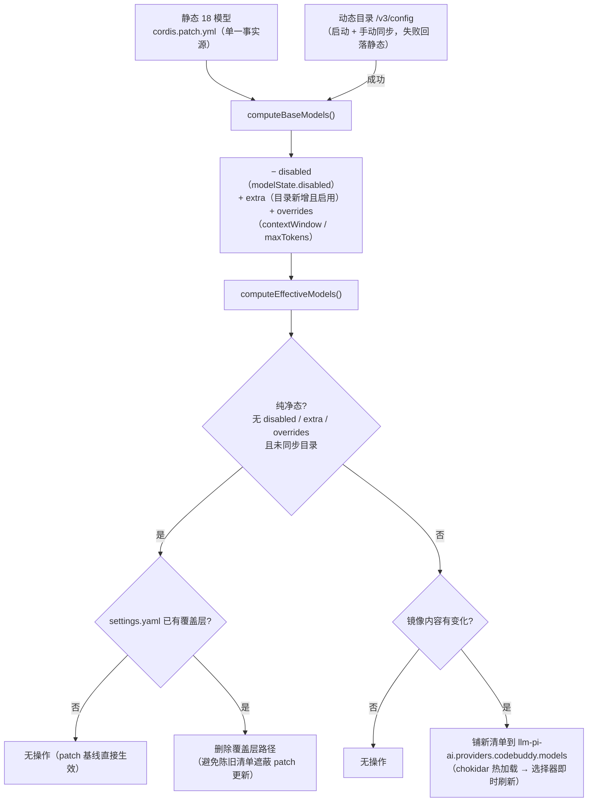
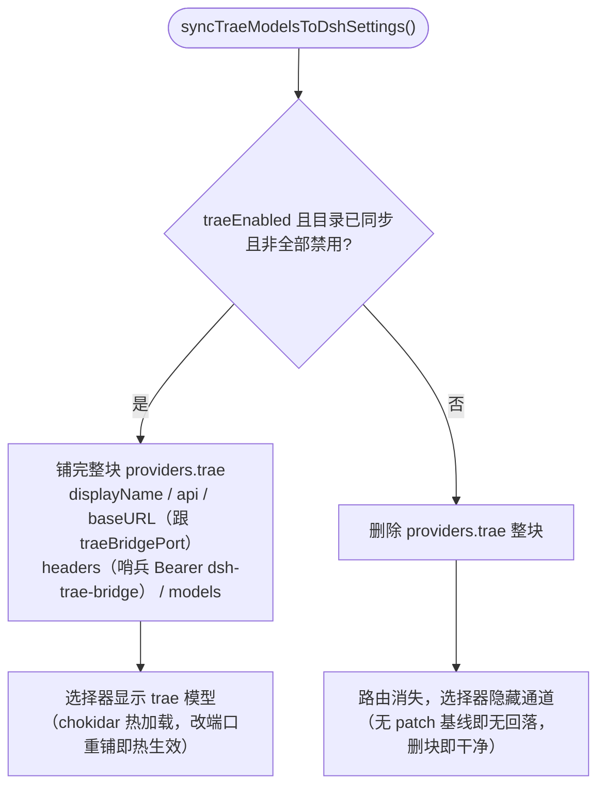
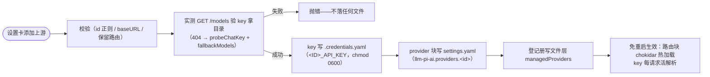

# 08 — 配置面、磁盘文件与数据流

## 磁盘文件清单（默认 `~/.dsh/`，可用 `DSH_HOME` 重定向）

| 文件 | 读写方 | 内容 | 权限/安全 |
|------|--------|------|-----------|
| `codebuddy-plugin.json` | 插件读写 | 设置文件层：全部用户设置 + `modelState`（disabled/extra/overrides）+ `traeModelState` + `managedProviders` 登记册 | 无 secret（apiKeys 有 key 明文，仅本机） |
| `codebuddy-plugin-auth.json` | oauth.js 读写 | CodeBuddy OAuth 令牌 + 账号信息 | **永不回传浏览器** |
| `trae-plugin-auth.json` | trae/oauth.js 读写 | Trae OAuth 令牌 + 账号 + **设备身份（P-256 私钥 PKCS#8）** | 私钥永不出存储；视图只出 `signatureFormat` |
| `codebuddy-plugin-usage.json` | usage-meter | 用量累计（totalCredit/days/recent） | 5s 去抖写盘 |
| `settings.yaml` | dsh 宿主（插件代写） | `llm-pi-ai.providers.codebuddy.models` 镜像 / `providers.trae` **整块** / `providers.<extraId>` 块——chokidar 热加载，**免重启** | 注释保留的文档编辑（yaml 库 parseDocument/setIn/deleteIn） |
| `.credentials.yaml` | 插件代写（dsh 约定） | 多服务商 key（`<ID>_API_KEY`）、`CODEBUDDY_API_KEY` 兜底 | **必须 0600**，写后 chmod |
| `generated-images/` | images.js | 无会话工作区时的生图落盘 | — |

## 配置优先级

```text
文件层（~/.dsh/codebuddy-plugin.json） > 组合入口（cordis entry config） > schema 默认值
```

每次读取活解析：`resolveNow = () => Config({ ...config, ...readFileLayer() })`——设置卡保存后**下一次读取即生效**，配合 `applyLive()`（起停桥/网关/注册表）实现免重启。

## 模型可见性数据流（三条镜像规则）

### 1. CodeBuddy（纯净态纪律）



- **纯净态**（无 disabled/extra/overrides 且未同步目录）→ **删除**覆盖层路径——陈旧的 settings 清单会遮蔽插件更新的静态模型。
- 动态目录存活期间**恒铺**（镜像内容每次启动随网关刷新，不算"陈旧"）。
- 基清单内的启停只动 `disabled`；目录新增模型禁用只删 `extra`（不写 disabled——否则状态永远非纯净）。

### 2. Trae（路由存在性管理，踩坑 #25 终版）

> 0.8.7 / dsh 0.1.1-rc.2 适配后的现行语义。旧版（≤0.8.5）"恒铺 models 路径 + 空数组遮蔽 patch 静态基线"已失效——llm-pi-ai 现在对非目录路由的**空 models 清单在 apply 时直接 throw**（连坐整棵 llm-pi-ai 纤维，主聊天全挂）。现行策略：patch **不带** trae 静态基线，`providers.trae` 路由的完整定义由镜像独占。



升级注意：≤0.8.5 写入的旧 trae 块只带 models 路径（缺 baseURL 等字段），dsh 升到 0.1.1-rc.2 后首次启动前须手动清理，否则 llm-pi-ai 先于插件报错（详见 [CHANGELOG](../CHANGELOG.md) 0.8.7 迁移说明）。

### 3. 多服务商（整块代写）



凭据缝每请求活解析 key（env > credentials.yaml），路由块 chokidar 热加载——全程免重启。

## 密钥安全边界

| 边界 | 规则 |
|------|------|
| 浏览器 ↔ 宿主 | GET 只回 `maskKey`（首 4 + 尾 4）；OAuth 令牌/设备私钥**永不**出现在任何响应 |
| 文件 | `.credentials.yaml` 写后 chmod 0600；OAuth 令牌单独文件（settings GET 的 `user` 字段来自设置文件层，天然不含令牌） |
| 取证日志 | `CODEBUDDY_BRIDGE_LOG` 不落明文消息文本（哈希 + 60 字符预览）；authorization 分类 sentinel/caller-set 不逐字落盘。`CODEBUDDY_BRIDGE_DUMP` 是唯一明文落点（本地诊断，慎开） |
| 导入 | local-scan 的 findings 只含路径/类型/过期元数据；真值只在用户确认导入那一刻读取 |

## 端口与路由总表

| 端口 | 进程 | 路由 | 说明 |
|------|------|------|------|
| 3901（bridgePort） | core 桥 | `/v2/*` 透传；`/chat/completions` 特化 | CodeBuddy 主聊天 + agenttool 透传；仅 127.0.0.1 |
| 3902（traeBridgePort） | Trae 翻译网关 | `POST /v1/chat/completions`；`GET /v1/models` | OpenAI↔Trae 协议翻译；仅 127.0.0.1 |
| 3080 | dsh web | `/dsh-tap/settings` | 设置卡自有路由（ctx.webServer） |

改 3901 端口必须同时改 `cordis.patch.yml` 的 baseURL（或反之），否则主聊天断（设置卡有明示）。

## 环境变量

| 变量 | 作用 |
|------|------|
| `DSH_HOME` | 重定向 `~/.dsh`（测试隔离用） |
| `CODEBUDDY_API_KEY` | 单 Key 兜底（env 优先于 credentials.yaml） |
| `CODEBUDDY_BRIDGE_LOG` | 桥取证日志 JSONL 路径（不落明文） |
| `CODEBUDDY_BRIDGE_DUMP` | 请求体明文落盘目录（仅本地诊断，慎开） |
| `TRAE_BRIDGE_LOG` | Trae 网关取证日志路径 |
| `DSH_WEB_SEARCH_PROVIDER` / `DSH_WEB_FETCH_PROVIDER` | 临时切回其他 web 后端（覆盖 patch 钉选） |
