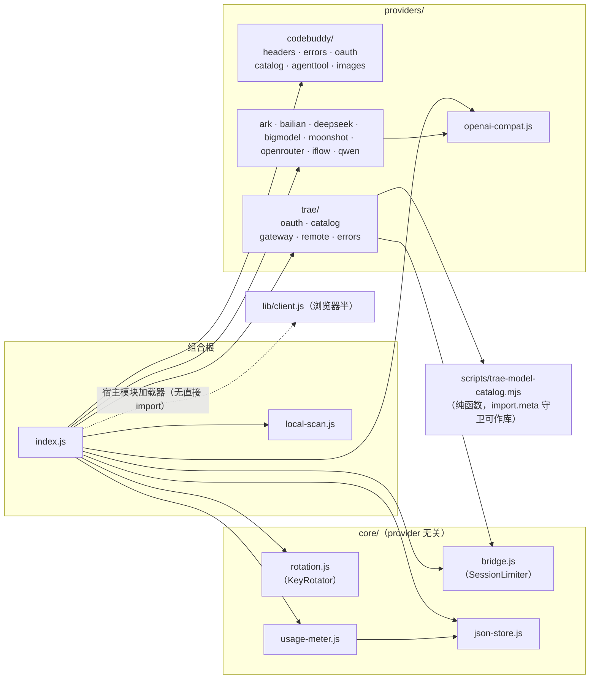

# 09 — 运行方式与测试体系

## 环境要求

- **Node ≥ 22**（纯 ESM，`"type": "module"`）
- 运行时依赖仅两个：`@deepseek-ai/schemastery`（3.18.1）、`yaml`（2.8.0）
- dsh ≥ 0.1.0-rc.7（settings.plugin.item keyed 槽位；rc.6 有兼容写法，见踩坑 #18）；0.8.7 起逐包适配至 **0.1.1-rc.2**（llm-pi-ai 对空 models 清单 apply 即 throw——从 ≤0.8.5 升级须先清理 settings.yaml 里的旧 trae 残块，见 [CHANGELOG](../CHANGELOG.md)）

## 安装与运行

插件是 dsh 的 bundle 包（`package.json` 声明 `dsh.bundle.patch`）；安装进 dsh profile 后由 cordis 加载：

```sh
# 起 dsh 测试服务（默认 3080 端口；插件随宿主启动自动 apply）
dsh web
```

启动后自动发生：

1. patch 生效：`llm-pi-ai` 的 codebuddy/trae 路由、默认模型 deepseek-v3、web 行钉选；
2. `insert` 让 loader 执行 `index.js` 的 `apply()`——注册 web/tools 资源、设置路由、起 :3901 桥；`traeEnabled` 开启时另起 :3902 网关 + 目录同步；
3. CodeBuddy 模型目录从 `/v3/config` 自动同步（失败无感回落静态清单）。

注意：**dsh web 增删插件后必须重启进程**（运行中清单是内存缓存）；WSL 下第二个 dsh 实例（甚至 `dsh web --help`）会抢绑 3901——桥已降级为告警不崩（踩坑 #17）。

## 登录（首次使用）

设置卡路径：Settings → 插件配置 → CodeBuddy → 登录区

- **OAuth（推荐）**：浏览器授权一次，覆盖主聊天/搜索/抓取/生图全部路径；
- **API Key**：卡内管理多 Key（≥2 自动轮询），或环境变量 `CODEBUDDY_API_KEY` 兜底。

TraeWork CN 分区：启用通道 → 登录（自持设备密钥的浏览器授权）→ 模型自动进选择器。

## 离线回归（无需网络/凭据，改动后必跑）

| 命令 | 覆盖 | 规模 |
|------|------|------|
| `node scripts/verify-bridge.mjs` | 桥：非流式聚合 / SSE 透传 / 会话头注入与保留 / 会话 FIFO 并发 / 非会话不限流 / agenttool 透传 / 取证日志 / 计量 / developer→system / EADDRINUSE 不崩 | 30 项断言 |
| `node scripts/verify-core-generic.mjs` | core/ 通用性证伪：静态纯净扫描 + 第二 OpenAI 兼容上游全链路（含 developer 角色不被 core 改写的另一半证明） | — |
| `node scripts/verify-rotation.mjs` | 多 Key 轮询（mock 网关按 Key 行为表；`?case=provider/bridge` 双实例隔离） | 25 项断言 |
| `node scripts/verify-providers.mjs` | 多服务商骨架：/models 404 兜底 + 认证方言 | — |
| `node scripts/verify-trae-provider.mjs` | Trae 通道：mock OAuth 全流程（**用我们注册的公钥验 DeviceProof 签名**）/ 目录映射 / 翻译网关 | 81 项断言 |
| `node scripts/verify-models.mjs` | 模型解析离线自检 / 在线探测可用性 / 目录漂移对比 | — |
| `node scripts/verify-trae-model-catalog.mjs` | 目录提取器回归 | — |

`npm run verify` = 在线模型探测；另有 `verify:bridge` / `verify:core` / `verify:providers` / `verify:trae` / `verify:trae-provider` 快捷方式。

**断言纪律**：验证队列/代理行为必须断言"响应完成"（EOF），不是首字节；跨层测试先想清楚轮转游标在第几个请求上。

## 在线探测/取证脚本（会消耗额度，按需使用）

| 脚本 | 用途 |
|------|------|
| `verify-models.mjs --sync` | 对比 `/v3/config` 目录漂移 |
| `verify-models.mjs --efforts [id…]` | 探测 reasoning_effort 档位 |
| `probe-ua.mjs` | UA 门矩阵探测（74 条证据可复跑） |
| `probe-oauth.mjs` | OAuth 设备流探测 |
| `probe-quota.mjs` | 额度信号探测（accounts/dosage-notify/资源包） |
| `probe-media.mjs` | 生图/视频/3D 端点探测 |
| `probe-routing.mjs` / `probe-moderation.mjs` | 路由与审核面 |
| `probe-cache.mjs` / `probe-cache-ttl.mjs` / `capture-cache.mjs` | 网关缓存对照（--model/--arms/--repeat/--calls） |
| `capture-traffic.mjs` | 受控主聊天流量（多轮/重发/子代理，经 3080 RPC） |
| `measure-latency.mjs --mock\|--real` | 识图/搜索端到端延迟分布（JSONL 落盘） |
| `probe-trae-live.mjs --login` / `--chat "文本"` | Trae 真实登录（一次性）与对话联调（证据落 docs/probes/ 校准信封） |
| `probe-trae-model-routing.mjs --round 2\|evidence\|3\|4` / `probe-trae-3003-diagnosis.mjs` | Trae 模型改派矩阵（四轮合并，轮次对应原 model-routing/routing-evidence/routing3/routing4） / 3003 故障定位取证 |
| `trae-model-catalog.mjs` | Trae 目录提取 CLI（纯函数可作库导入，import.meta 守卫） |
| `hermes-probe-dev-role.mjs --round 1\|2\|3` | developer 角色事件取证（三轮合并，轮次对应原 -role/-role2/-role3） |

**取证开启方式**：

```sh
CODEBUDDY_BRIDGE_LOG=/tmp/bridge.jsonl dsh web   # 请求哈希/头特征/usage（不落明文）
CODEBUDDY_BRIDGE_DUMP=/tmp/dump dsh web           # 叠加请求体明文（仅本地诊断，慎开）
```

## 浏览器回归（UI 改动后）

脚本位于**仓库外**本地目录 `dsh-ui-test/`（puppeteer-core + 系统 Chrome，不进仓库）：

- `_helpers.js`：共享驱动（打开卡片、请求计数、Key 清理、模式切换、`normalizeField`——基线一律从 GET /settings 实况读取并收尾复原）；
- step20（设置卡 22 断言，含 7 标签顺序与折叠态芯片）、step22（流畅度 22 断言：DOM 标记证明保存不卸载/严格 1 POST+1 GET/草稿跨标签保留/思考档位/Key 排序）、step24（生图 7 断言）、step25（额度与用量 13 断言：可见才轮询/切走即停）、step26/27/28/29/31-trae 等；
- 跑前 `dsh web`（建议 `--disable-http-cache` 对抗浏览器缓存），跑后杀 3080；
- 选择器一律按 `.cbc-*` 类与行内单元格精确匹配（step20 曾因模糊匹配误删 Key）。

## 依赖关系图（模块级）



外部依赖：Node 内建（fs/os/path/http/crypto/url）+ `yaml` + `@deepseek-ai/schemastery`；宿主服务经 `ctx.inject`（web / webServer / tools / settings）。**插件不能 import `@deepseek-ai/*` 运行时包**（加载器按插件路径解析——踩坑 #9），provider 接口用鸭子类型零依赖实现。

## 故障速查

| 症状 | 优先检查 |
|------|----------|
| 主聊天 503 "credential unavailable" | 设置卡登录区（apiKeys 空 / OAuth 过期） |
| 主聊天全挂 content_filter | 桥的 developer→system 重写是否被绕过（verify-bridge §9） |
| 主聊天连接失败 | bridgePort 与 patch baseURL 是否一致；`bridgeRuntime.lastError`（设置卡桥分区） |
| 设置卡模型勾了但选择器没有 | CodeBuddy：settings.yaml 镜像是否写入（`syncModelsToDshSettings`）；Trae：`providers.trae` 整块是否存在（禁用/未同步 = 删块属正常语义） |
| trae 3003 | 服务端 inline 面故障（非凭据问题）——切 remote 传输或等自愈 |
| 添加服务商后整个用户层 provider 消失 | settings.yaml 坏块连坐（踩坑 #21）——检查手动写入的块 |
