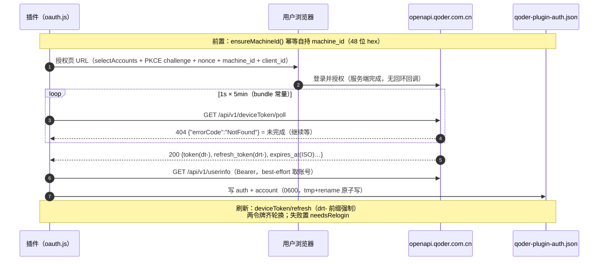
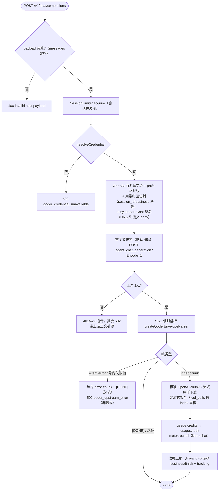

# 10 — providers/qoder/（Qoder CN 订阅额度通道）

> 目录：[providers/qoder](../providers/qoder)。与 `providers/trae/` 同构：本目录收敛全部 Qoder 上游事实，core/ 与组合根经结构钩子消费。证据档案：`docs/goals/qoder-cn-provider-design.md`（§2 逆向事实、§5b/§5d/§5e 联调实录——聊天面定论以 §5e 为准）。

## 通道总览

| 维度 | 事实 |
|------|------|
| 域名分工 | 授权页 = `qoder.cn`；设备流/用户面 = `openapi.qoder.com.cn`；infer 节点（聊天 + 目录）= `gateway.qoder.com.cn`（region 发现服务给出，CN 实测恒为 gateway） |
| 凭据 | **只有 OAuth**（订阅额度跟账号走，无多 Key 轮换）；PKCE S256 设备流，machine_id 自持持久化 |
| 聊天签名 | COSY WASM：`qoder_auth.wasm`（官方 CLI bundle 内嵌 base64 原字节，298KB）+ 手写 wasm-bindgen 胶水；**签名入口 = `QoderContext.prepareInferRequest`**（签名绑定改写后 URL，不可手改） |
| 聊天端点 | `POST {infer}/algo/api/v2/service/pro/sse/agent_chat_generation?FetchKeys=llm_model_result&AgentId=agent_common&Encode=1`——body 由 WASM 加密 |
| 出站头组 | 全由 WASM 产出：`Bearer COSY.*` + `Cosy-*` 全家 + `X-Model-Key`/`X-Model-Source` |
| 入站形态 | SSE 信封 `data:{headers,body,statusCodeValue}`——`body` 是**字符串**，内容为标准 OpenAI `chat.completion.chunk` JSON（增量/tool_calls/finish_reason 全标准）或 `"[DONE]"` |
| 模型目录 | 签名 `GET /algo/api/v2/model/list?Encode=1`（`.chat[]` 14 个 openai 条目全 enable，2026-09-20 实测） |
| 计量 | usage 帧 `usage.credits` → 归一为 `usage.credit` 进 usage-meter |
| 反面事实（勿走） | `api2-v2.qoder.sh` 的 OpenAI 兼容面**裸 Bearer 恒 401**（疑似付费/BYOK 面）——废弃；`prepareRequest` 的 /algo 重写**只用于目录面**，聊天面走它必挂（§5e 实录） |

## index.js — createQoderProvider(deps)

```js
export const QODER_PROVIDER_ID = 'qoder'

const provider = createQoderProvider({
  readAuth, writeAuth,          // ~/.dsh/qoder-plugin-auth.json IO
  settings: () => qoderSettingsFn(),   // 迟绑定本代 settings（apply 每代重设）
  meter, runtime,               // 计量 + 网关运行态（lastError 降级）
  forensics: { logPath: () => process.env.QODER_GATEWAY_LOG },
})
```

返回 provider：`{ id, oauth, cosy, gateway, syncCatalog(), catalogView(), credentialView() }`。

- `syncCatalog()`：签名拉一次网关目录，成功换新 `catalogState`（`{ profiles, sources, fetchedAt }`；未登录报 `ok:false` 且**不清旧目录**）；
- `catalogView()`：`{ at, count, profiles } | null`；
- `credentialView()`：OAuth 脱敏视图（设置卡；令牌与 machine_id 永不出宿主）；
- 目录实例状态在工厂闭包内（踩坑 #20 纪律）。

## oauth.js — PKCE S256 设备流（无回环回调）

```js
export function createQoderOAuth({ readAuth, writeAuth })
// => { startOAuth, resolveQoderCredential, refreshOAuth, oauthStatus, logout, ensureMachineId }
```

**与 codebuddy/trae 的形态差异**：

- **没有本地回环回调服务**（不像 Trae 的 `/authorize`）——授权在服务端完成，插件只轮询，故无回调页 XSS 面；
- poll 的"未完成"是 **HTTP 404**（`{"errorCode":"NotFound"}`，Bao 风格信封）而非业务码——**404 绝不与失败混同**；
- 没有多 Key 轮换，单账号。

流程：

1. **PKCE**：本地生成 verifier（43–128 字符，`A-Za-z0-9-._~`）+ `challenge=S256(verifier)`；`nonce=UUID`、machine_id（48 位 hex 自持）均客户端生成；
2. **授权页**：`GET <loginHost>/device/selectAccounts?challenge=&challenge_method=S256&nonce=&machine_id=&client_id=<prod uuid>`（无 cookie → 302 登录页；`qoder.cn` 与 `qoder.com.cn` 双域同构）；
3. **轮询**：`GET <openapi>/api/v1/deviceToken/poll?nonce=&verifier=&challenge_method=S256`——间隔 1s、上限 5 分钟（bundle 常量）；404=未完成继续等，缺参=400 精确业务码，200 出令牌；
4. **令牌形态**：access `dt-`（30 天）、refresh `drt-`（约 1 年，**前缀强制**——bogus 实测 `DeviceRefreshTokenPrefixInvalid`）；`expires_at`/`refresh_token_expires_at` 是 **ISO 字符串**（按数字解会退化成 epoch 0，normalizeExpiry 三形态归一：相对秒/绝对秒/绝对毫秒，verify [2] 锁）；
5. **刷新**：`POST <openapi>/api/v1/deviceToken/refresh {refresh_token, machine_id}`（单飞锁）；响应常只换 access 不带 refresh_token——**缺字段沿用旧值**（写 null 会断掉续期）；失败置 `reloginNeeded` 粘性信号；
6. **凭据分支**（`resolveQoderCredential(s)`）：临期（<60s）自动刷新，返回 `{authorization: 'Bearer <dt->', machineId, uid}`；
7. **logout**：只清令牌与账号，**machine_id 保留**（跨登录复用）；`pollGeneration` 代际守卫使 logout 后才完成的迟到授权不落盘；
8. **出宿主双门禁**：`assertLoginBase`（基址前置校验，非法设置不产生任何写入）+ `assertSafeAuthUrl`（scheme=https + host ∈ 官方站点族 `qoder.cn`/`qoder.com.cn` 或回环——host 来自用户设置，"与 base 同域"判据形同虚设，不采用；verify [5] 锁）。

### 设备流时序（无回环回调，纯轮询）



## cosy.js — COSY WASM 签名运行时

```js
export function createCosyRuntime({ wasmPath })
// => { ensureContext(cred), prepareChat(cred, {endpoint,body,modelKey,modelSource}),
//      prepareGet(cred, {endpoint,path}), decrypt(text) }
```

- **版权边界**：wasm = 官方 CLI（`@qodercn-ai/qoderclicn` 1.1.57）bundle 内嵌 base64 解出的**原字节**，未修改，随官方包分发；胶水按 wasm-bindgen ABI 惯例**手写**（heap 表/passString/栈指针返回槽/handleError），不复制 bundle 文本；
- **两个签名入口的分工**（2026-09-20 实测，勿混淆）：
  - `prepareInferRequest(endpoint, bodyJson, modelKey, modelSource)` = **聊天面**：URL 恒映射到 infer 节点的 `agent_chat_generation`，body 由 WASM 加密；
  - `prepareRequest(...)` = **目录等管理面**：把任意路径重写为 `/algo` 前缀 + `?Encode=1`，签名绑定改写后 URL——聊天面走它必 401/404；
- **第三入口 `prepareSigned(cred, {endpoint, path, method, mode, body})`**（2026-09-22 用量归因课题新增）：`prepareRequest` 直通——`mode:"auth"`（/algo 重写+加密，business/finish 用）、`mode:"sign"`（仅签名，/api/v1/tracking 用；实测 wasm 对 sign 模式也重写为 `/algo` 前缀 + Encode=1，与官方线缆一致）；
- **infer 节点由 region 发现服务给出**：`GET /api/v3/service/region/endpoints`（sign 匿名模式可取，响应 Encode=1 密文需 decrypt）——CN = `gateway.qoder.com.cn`；
- **胶水两个实测坑**（踩坑 #36）：`RequestResult.headers` 是 **JS Map**——`{...map}` 展开得空头组、服务器直接断连无报错，必须 `Object.fromEntries`；手写胶水位运算永远加括号（`ptr >>> 0 + len` ≡ `ptr >>> len`）；
- **线程/并发**：WASM 实例单例（模块级 promise 缓存，失败不缓存下次重试）；QoderContext 持不可变凭据快照，`machineId:accessToken` 键变化（refresh 轮换）即重建上下文（构造便宜，WASM 不重载）；
- `decrypt(text)`：`decrypt_server_response` 解 Encode=1 密文，**失败原样返回**（部分端点本就回明文）。

## catalog.js — 签名目录（明文/密文两态）

```js
export function projectQoderModel(entry)              // 目录条目 → dsh profile
export async function fetchQoderCatalog(cosy, cred, inferBaseURL)  // { profiles, sources, raw }
```

- 签名 GET `/algo/api/v2/model/list?Encode=1`（`cosy.prepareGet`，auth 模式）；2026-09-20 实测该端点**回明文 JSON**（服务端不加密）——JSON.parse 失败才走 `cosy.decrypt` 兜底（两态自适应）；
- 只收 `.chat[]` 里 `format==='openai'` 且 `enable!==false` 的条目（实测 14 个全满足：Qwen3.8-Max/Flash **is_free**、Qwen3.7 系、DeepSeek-V4-Pro/Flash、GLM-5.3/5.3-Flash/5.2、Kimi-K3、auto）；
- 映射：`contextWindow` 取 `context_config` 默认档（无则 `max_input_tokens`）；目录不发布输出上限——`maxTokens` 取 **32768 保守默认**（镜像后可在 settings.yaml 手调）；`is_vl → input:[text,image]`；
- `sources`：逐条目记 `source`（实测全 `system`）供出站 `X-Model-Source` 头取数。

## gateway.js — OpenAI↔COSY 翻译网关（:3903）

> 与 core 桥的分工同 trae 网关：core 桥是**透传代理**（上游说 OpenAI 方言）；本网关是**协议翻译器**——Qoder 聊天面的线缆形态是 COSY 签名 + WASM 加密 body + SSE 信封，必须拆封/重封。复用 core 原语：`SessionLimiter`、`extractSessionId`、usage-meter。

```js
export function createQoderGateway(deps)  // => { listen(port), handleChat(req, res, rawBody) }
export function createQoderEnvelopeParser()  // SSE 信封解析器（单测可导入）
```

路由：`POST /v1/chat/completions`（或 `/chat/completions`）→ `handleChat`；`GET /v1/models` → 目录 id 清单；其余 404。listen 失败降级 `runtime.lastError` 不崩（踩坑 #17 纪律）；入站 Host 门（非回环先 `req.resume()` 丢体再 403，同 trae 网关审计面）；请求体 `Buffer.concat` 一次解码（踩坑 #28 纪律），上限 32MB。

### handleChat 主流程

1. **payload 校验**：messages 非空数组，否则 400 `invalid chat payload`；model 缺省回落 `'auto'`；
2. **并发闸**：`SessionLimiter.acquire(sessionId, maxConcurrentPerSession ?? 4)`（会话 id 提取同 core 桥，无则随机 UUID）；
3. **凭据**：`resolveCredential(s)` 为空 → 503 `qoder_credential_unavailable`（文案引导设置卡授权）；
4. **出站构造**：OpenAI 字段**白名单**透传（messages/tools/tool_choice/temperature/top_p/max_tokens/stop/reasoning_effort…，`CHAT_FIELDS`，pi-ai 私有扩展不透传）+ 强制 `stream:true` + `stream_options.include_usage`；**messages 过 `sanitizeToolPairing()`**（见下节"出站 tool 配对修复"）；
5. **逐模型 prefs 补默认**（2026-09-22）：payload 未带 `reasoning_effort` 且 `getModelPrefs(model).effort` 已设（≠off）→ 注入；`effort=off` = 省略参数（与 cordis.patch.yml verified 语义一致）；payload 未带 max_tokens/max_completion_tokens 且目录 profile 存在 → 注入 `max_completion_tokens=profile.maxTokens`；**客户端带值绝不覆盖**；
6. **用量归因信封**（2026-09-22 臂 9 定论：配额扣减（addOnQuota.used）对裸 OpenAI body 也实时入账——整数读数曾吞掉小额探测致"不记账"假阴性；但**统计视图**（heatmap/summary/明细）是延迟批处理、由归因链驱动）：出站 body 补官方 `A6e` 信封的归因字段——`request_id`/`request_set_id`/`chat_record_id`（=request_id）/`session_id`（dsh 会话→UUID 实例级映射，跨请求稳定）/`chat_task:"FREE_INPUT"`/`chat_context`（text=最后 user 文本）/`is_reply:true`/`is_retry:false`/`source:1`/`version:"3"`/`agent_id:"agent_common"`/`task_id:"common"`/`session_type:"qoderclicn"`/`aliyun_user_type:""`/`model_config`（取目录原始条目 `getCatalogEntry`）+ `business` 块（`id`=request_set_id、`stage:"processing"`、`name`=prompt 前 10 字）；
7. **签名**：`cosy.prepareChat(cred, {endpoint, body, modelKey, modelSource})` 产出 URL/头组/密文 body（**签名绑定 URL，不可手改**）；
8. **首字节护栏**：`upstreamFirstByteTimeoutMs`（默认 45s，复用 trae 同名设置）——fetch 响应头到达即清定时器，只约束"连上却不出头"的死态；
9. **上游非 2xx**：401/429 原状态透传，其余归 502，错误体带上游正文前 200 字符；
10. **SSE 拆封**：`createQoderEnvelopeParser` 吃 `(eventName, dataText)`——`event:error` → 错误帧；`body==="[DONE]"` → done；尾帧（计时统计，无 body）忽略；inner chunk 解析后**无 choices/usage 且有 code/message = 带内失败帧**（2026-09-22 新增识别，实测形态 `{"code":"400","message":"[FAIL]node:…"}`——传输层 200 的业务失败，旧实现静默吞，见错误处理表）；其余得**标准 OpenAI chunk**，流式入站原样下发、非流式入站聚合（content/reasoning_content/tool_calls 按 index 累积/finish_reason）；
11. **usage/计量**：usage 帧（`choices:[]`）的 `usage.credits` 归一为 `usage.credit` → `meter.record`（kind=chat）；取证日志 `QODER_GATEWAY_LOG`；
12. **收尾上报**（2026-09-22，与官方客户端同构、fire-and-forget `.catch` 落地不阻塞主链路）：每轮结束发两条 COSY 签名上报——`POST /api/v2/service/business/finish?Encode=1`（`prepareSigned` mode `"auth"`；`BUSINESS_FINISH` 事件，`business.id`=请求侧 request_set_id、`session_id` 同源，stage complete/error）+ `POST /api/v1/tracking`（mode `"sign"`；`qodercli-back-flow-agent-query-finish` 事件，聚合 `total_credits`/`total_*_tokens`）。aid/yx_uid 暂无来源置空串（服务端仍 success 接收）。

### handleChat 流程图



## 出站 tool 配对 + 可见性修复（sanitizeToolPairing，2026-09-22）

**症状**：工具轮之后的下一次请求报
`qoder upstream error: {"code":"provider_error","message":"Error in upstream response","request_id":"…","type":"provider_error","details":"{\"error\":{\"message\":\"Messages with role 'tool' must be a response to a preceding message with 'tool_calls'\"…}}"}`。

**根因（两个独立触发，同一条报错文案；2026-09-22 单变量差分批正首版定案，踩坑 #41 为主因、#39 为次因）**：严格家族（dmodel/kmodel/mmodel）的上游校验器**把 `content` 为 `null`/缺键的消息整条当"不存在"**。

1. **主因（每个工具轮必炸）**：宿主 `@earendil-works/pi-ai` 的 `convertMessages`（openai-completions.js:961）在 `compat.requiresAssistantAfterToolResult=false`（我们这种自定义 provider 走 `detectCompat` 的默认判定）下，把**每一个纯工具轮**序列化成 `{role:'assistant', content:null, tool_calls:[…]}`——声明在校验器眼里蒸发，紧随的 `role:"tool"` 就成了孤儿。所以 dsh 在 dmodel 上**第一次调用工具就必报**，与是否发生过中断无关。
2. **次因（失败/中断之后）**：`transform-messages.js` 把 `stopReason==='error'||'aborted'` 的 assistant **整条丢弃**、却保留其 `toolResult` → 出站 `[system, user, tool, user]` 真孤儿（踩坑 #39 的原始观察，离线用真实 `convertMessages` 100% 复现）。

**首版修复为什么没用**：#39 补孤儿时插的桩是 `content:null` —— 桩自己在校验器眼里同样不存在，于是"修完仍报同一条错"（实测 `B_orphan_stub_null` ❌ / `B_orphan_stub_empty` ✅）。而且首版验证跑在**容错家族 `qmodel`** 上（它对一切坏体静默容忍），等于没验。

**触发场景与自续循环**：一次失败/中断的工具轮（上游 400、5xx、用户 Esc、流中断）会把当轮 assistant 写成 `stopReason=error/aborted`（`dsh-llm-pi-ai` 的 `case "error"` → `mapStopReason(event.error)`），**这条消息留在会话历史里**——于是此后**每一次**请求都带孤儿 tool 结果，直到该会话被丢弃。这解释了现场"第一次报错后怎么重试都是同一个错"。

**修复落点**：插件不能改宿主 pi-ai（踩坑 #9 的依赖边界），所以在**翻译网关出站口**做消息体检——`sanitizeToolPairing(messages)` 纯函数（`providers/qoder/gateway.js` 导出，verify-qoder [18] 锁定案）：

| 出站形态 | 处理 |
|---|---|
| assistant / tool 的 `content` 为 `null` 或缺键 | 补成 `''`（**可见性归一**，主因修复；`repaired.invisible` 计数）——OpenAI 方言里 null 与 `''` 语义等价，但严格上游只认非 null |
| 孤儿 `role:"tool"`（前置 assistant 被删） | 补一条**仅含该 tool_call 的 assistant 桩**（id 取原 `tool_call_id`，name 取 tool 消息的 `name` 或 `'tool'`，**content 用 `''`**）后原样保留结果——比丢弃结果更保上下文（实测上游放行两态） |
| assistant 声明了 tool_call 但缺结果（会话尾 / user 插在结果前） | 补 `(tool result unavailable: previous attempt was interrupted)` 结果，保住配对 |
| 同 id 的重复结果 | 丢弃第二条（上游会当孤儿） |
| `content` 非空的合法历史 | **逐字节不变**（修复不碰正常请求；键序也不变——spread 原位覆盖） |
| `role:"developer"`（pi-ai 对 reasoning 模型序列化 system prompt 的产物） | 网关出站折叠为 `system`（上游在**反序列化阶段**整请求拒绝 developer：`Failed to deserialize the JSON body...`；同 codebuddy 桥策略） |

**上游拒绝面按模型家族分裂**（同一条坏体，只切一个字段实测）：

| assistant.content | dmodel | kmodel | mmodel | auto/qmodel/qmodel_38max/gmodel |
|---|---|---|---|---|
| `null` / 缺键 | ❌ `Messages with role 'tool' must be a response to…` | ❌ `Invalid request: tool_call_id is not found` | ❌ `invalid params, tool result's tool id(…) not found (2013)` | ✅ 静默容忍（多为空正文） |
| `''` / 非空文本 | ✅ | ✅ | ✅ | ✅ |

`role:"tool"` 自身 `content:null` 另报 `An assistant message with 'tool_calls' must be followed by tool messages responding to each 'tool_call_id'`（结果被当成没回）。

**为什么官方 Qoder CN 客户端从不触发**（本机取证，非推断）：`~/.qoder-cn/projects/**/*.jsonl` 105 份 transcript 里 `tool_use`/`tool_result` **孤儿 result 恒 0**（计数不等时缺的永远是「结果」，不是「声明」）；按 `message.id` 归并的 **879 个工具回合中 93.3% 带非空 thinking、52.8% 带非空 text，裸 tool_use（≈`content:null`）仅 2.73%**；252 份 `qodercli.log` 显示官方同样在客户端重放全量历史（`request_message_count` 一路涨到 **457**），却**零条** `provider_error`/配对 400。即差异不在端点、不在服务端校验，而在**客户端历史构造纪律**：官方几乎总给工具轮带上非空正文，且中断时删的是「结果」而非「声明」。

修复只动 `messages`，字段白名单、prefs 补默认、签名/加密、计量路径全不受影响；取证日志出站行带 `repaired=orphans=N synthesized=M duplicates=K invisible=J` 便于观察触发频率（`QODER_GATEWAY_LOG` 开启时）。复现与复核：`node scripts/probe-qoder-pairing.mjs --offline`（宿主真实序列化器复现 + 严格校验器）、`node scripts/probe-qoder-null-content.mjs --models dmodel --gw-local`（单变量差分 + 修复前后端到端）；证据 docs/probes/qoder-null-content-\*.json、qoder-pairing-\*.json。

**上游容错面按模型家族分裂（差分矩阵实测，docs/probes/qoder-matrix-1790023075879.json）**：孤儿 tool 在 **dmodel/kmodel/mmodel 上 400**（内层文案三家各一：`Messages with role 'tool' must be a response…` / `Invalid request: tool_call_id  is not found` / `invalid params, tool result's tool id(…) not found`），在 **auto/qmodel_38max/qmodel/gmodel 上被静默当文本处理**——所以"换成 auto 能跑"不能证伪协议问题，诊断必须按模型家族取样。

## 模型路由是头驱动的（2026-09-22 实测，排错必读）

服务端按 **`X-Model-Key` 头**（= `prepareChat` 的 `modelKey`）选推理节点，**body 里的 `model` 字段不决定路由**：`X-Model-Key: qfmodel` + body `model:"auto"` → 打到 Flash 的节点；`X-Model-Key: auto` + body `model:"qfmodel"` → 走 auto。所以排"模型用不了"时必须同时核对两处（插件两处同源：`upstream.model` 与 `modelSourceOf(model)`/`modelKey` 都取客户端的 `model` 字段）。

模型故障排查入口：**docs/diagnosis-qoder-flash.md**（Qwen3.8-Flash 上游节点 `oa_qwen-plus-main` 故障的完整证据链与排除矩阵），确认探针 `scripts/probe-qoder-flash-confirm.mjs`。

## 逐模型调节（qoderModelPrefs，2026-09-22）

设置卡 Qoder 区每行两个 select（控件仿 Qoder 官方客户端）：**思考强度**（档位 off/low/medium/high/max，默认=不注入）与**上下文长度**（选项 = 目录 `context_config` 变体，如 Qwen3.8-Max 的 200K/400K/1M；无变体的模型不出该控件）。

- **存储**：文件层 `qoderModelPrefs`（`~/.dsh/codebuddy-plugin.json`）——`{[id]: {effort?, contextVariant?}}`，只存已设键；**完整替换语义**（patch 发全量期望态，`{}` = 删记录回默认）；校验严格（未知键/非法档位/未知变体/目录外 id 一律 400 带中文原因，踩坑 #7）。
- **写路径**：patch action `qoderModelSetPrefs` → `setQoderModelPrefs` → 写文件层 → `syncQoderModelsToDshSettings` 镜像。
- **镜像**：settings.yaml 的 `providers.qoder.models` 条目仅在选中变体时改 `contextWindow`（= 变体 token_count）；未选/变体消失回落目录默认档；`variants` 不进 settings.yaml（镜像形状零扰动）。
- **读侧契约**：GET /dsh-tap/settings 的 `qoder.models` 带 `modelPrefs`（当前值）与 `variants`（`[{name,tokenCount,isDefault}]`，无变体 → 缺省/空数组）——UI 唯一数据源。
- **出站**：见 handleChat 第 5 步（补默认注入，客户端带值不覆盖）。

## 错误处理（无独立 errors.js——归网关内联映射）

| 场景 | 映射 |
|------|------|
| 入站 payload 非法 | 400 `invalid chat payload` |
| 未登录/凭据不可用 | 503 `qoder_credential_unavailable`（引导设置卡授权） |
| 上游 401 / 429 | 原状态透传（其余非 2xx 归 502，带上游正文前 200 字符） |
| SSE `event:error` 帧 / inner chunk 非法 JSON | 流内 error chunk + `[DONE]`（流式）/ 聚合已收内容 |
| **带内失败帧**（HTTP 200 信封装业务错误：无 choices/usage、有 code/message） | 流式 = 错误 chunk + `[DONE]`；非流式 = **502 `qoder_upstream_error`** 带上游 body 前 400 字符（2026-09-22 修复：旧实现静默空响应/挂死） |
| 首字节超时 | AbortController 中止 → 500 `qoder gateway error: …首字节超时` |
| listen 失败（EADDRINUSE 等） | 降级 `runtime.lastError` + stderr 告警，不崩宿主 |

## 验证与探测

| 命令 | 覆盖 |
|------|------|
| `node scripts/verify-qoder-provider.mjs` | 离线 **154 断言**（2026-09-23 实测）：PKCE 形态/normalizeExpiry 三态/设备流快乐路径/授权 URL 门禁/刷新回写与 needsRelogin/临期自动刷新/logout 代际守卫/machine_id 自持/视图脱敏 + mock 上游的网关翻译（流式逐帧/聚合/计量归一/错误帧/**带内失败帧两态**/401 透传/Host 门//v1/models）+ 目录投影 + **prefs 出站注入 9 断言** + **组合根端到端 23 断言**（真 apply 起网关，prefs→镜像→注入全链）+ **[18] tool 配对与 `content` 可见性归一**（踩坑 #39/#41 锁定案）+ **[19] 用量归因上报**（business/finish 与 /api/v1/tracking 的 join key 同源） |
| `node scripts/probe-qoder-live.mjs --login` | 真实设备流登录（浏览器授权；令牌只打掩码，存 `~/.dsh/qoder-plugin-auth.json`） |
| `node scripts/probe-qoder-live.mjs --chat "文本" [--model <key>]` | 真实对话（cosy 签名路径；证据落 docs/probes/）。**key 必须用目录真实值**（`--catalog` 或 settings.yaml 镜像块查）——臆造 key 被上游静默改派 auto（踩坑 #37） |
| `dsh-ui-test/qoder-prefs-check.js`（仓库外） | 浏览器端到端 **37 通过 / 静态 39 站点 / 跳过 0**（2026-09-23 实测）：渲染/变体条件渲染/持久化往返/完整替换语义/镜像生效/回默认/去抖/跨折叠保留（0.10.0 起驱动 = 展开 `.cbc-acc-toggle[data-block=qoder]` 区块，不再是切标签） |

## 已知边界（诚实标注）

- 单账号 OAuth，无多 Key 轮换（与 Trae 一致）；logout 保留 machine_id。
- `maxTokens` 目录不发布，投影取 32768 保守默认——出站未带时网关以 profile.maxTokens 补默认；更大上限在 prefs/settings.yaml 层调。
- 上游错误正文只回显前 200 字符（带内失败帧前 400）；Qoder 错误信封不像 Trae 有稳定码表，不做码表回填。
- **Qwen3.8-Flash（qfmodel）2026-09-22 上游节点故障**：上游后端 `oa_qwen-plus-main` 对任意请求返回带内 400 `Execution failed`（连续 3 次复测，证据 docs/probes/qoder-chat-live-1790007\*.json）——属上游侧，待其修复后复测；插件侧已表现为可读 502。
- 响应 chunk `model` 字段恒为 `"auto"`（上游行为），不可作路由/归因证据（踩坑 #37）。
- 通道实证账号为 `PLAN_TIER_FREE`（quota:0）——FREE 账号实测可对话（目录含 `is_free` 条目），但**付费墙策略随时可变**（api2-v2 面已实证对裸 Bearer 关死）。
- 翻译网关只做**只读对话**用途：不触碰 agent 面其他能力（设计文档 §8 纪律）。
